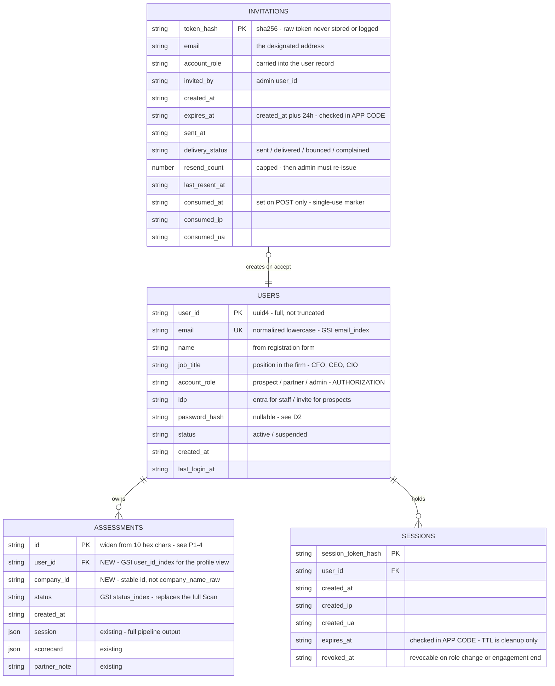
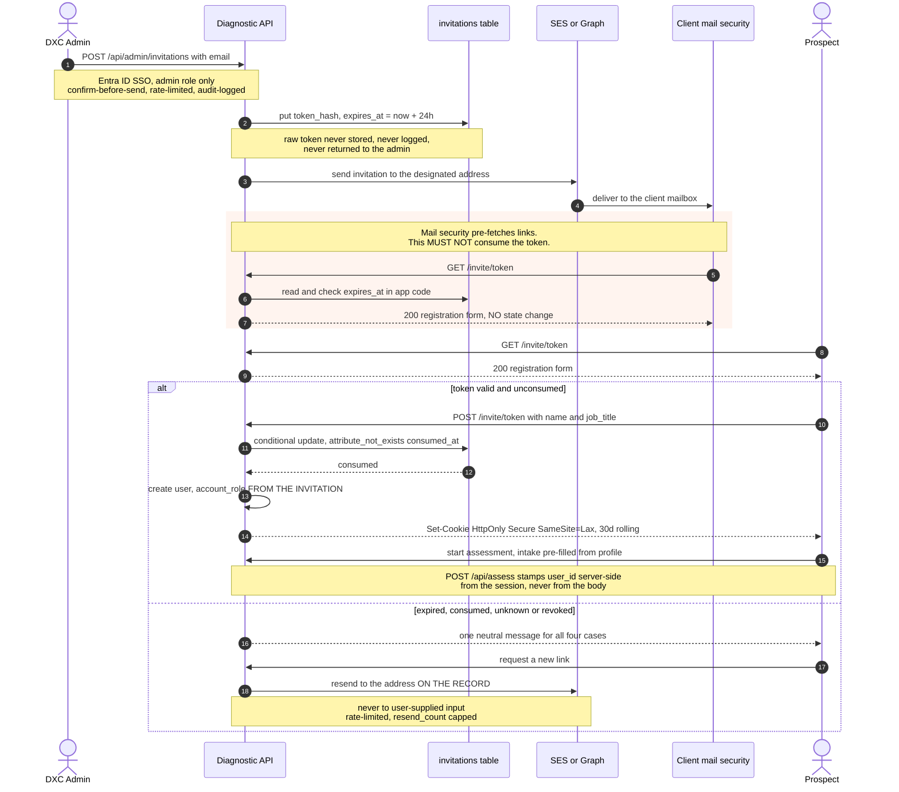
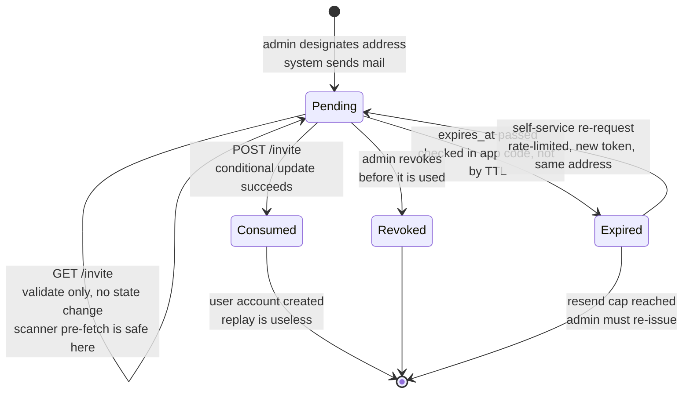
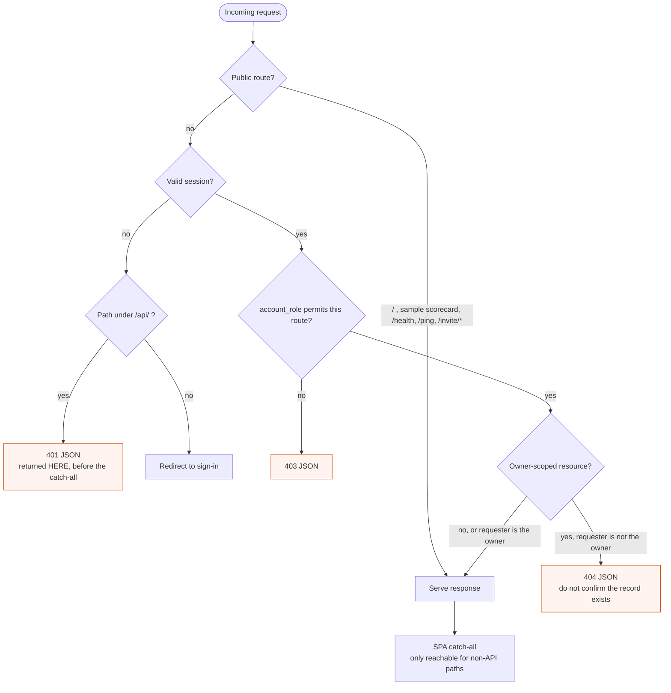
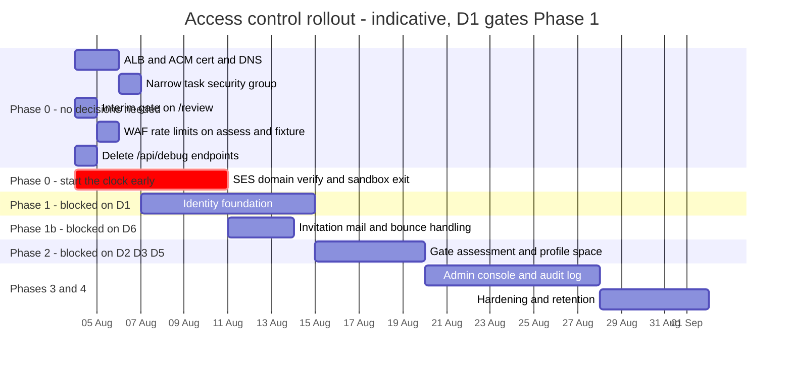

# Architecture Review — Access Control, Identity, and User Spaces

**Date:** 3 August 2026
**Author:** Denis Morozov
**Reviewed commit:** `cbfa830` (branch `main`)
**Status:** For review — contains decisions that are not mine to make (marked **D1–D6**)
**Revision:** 3 — incorporates review feedback across two rounds: `role` clarified as the user's
position in the firm (§5b rewritten); TLS finding retained (**P0-1**); out-of-band link sharing dropped
in favour of system-sent invitation email (§5c rewritten, new **D6**); invitation TTL set to
**24 hours**, which makes self-service re-request mandatory and rules out relying on DynamoDB TTL for
expiry enforcement (§5c)

---

## 1. Scope

This review covers four gaps raised for the AI Readiness Diagnostic:

1. The interview submission page is open to anyone.
2. There is no user profile space (a user cannot see their own past interviews and scorecards).
3. There is no admin interface (no cross-participant view of interviews and scorecards).
4. There is no authentication, and therefore no defined path from guest to authenticated user.

It also proposes a target architecture and a phased plan, and it evaluates the specific
invitation workflow put forward. As revised during review, that workflow is: *an admin designates a
user by email address; **the system emails that address** a single-use invitation; the recipient opens
it and completes registration by setting their name and position (and a password, subject to **D2**);
the system then proceeds to the interview.* Out-of-band sharing of the link — Slack, forwarded mail,
copy-paste — is explicitly dropped (§5c).

**This review is a concrete answer to open item #3** ("Resolve auth — Entra ID vs external identity",
owner Alex Schick, due w/c 28 Jul, severity HIGH), which is currently overdue. It also surfaces two
questions that belong to open item #4 (Legal — retention, residency, consent) because they block
schema design, not just policy.

**Out of scope:** the scoring engine, the agent pipeline, model tiering, and the deterministic
fallbacks. Those are covered in `ARCHITECTURE.html` §03–§04 and are unaffected by this work.

---

## 2. Verdict

All four gaps are confirmed and correctly identified. Current state, verified against the code:

| Claim | Verified |
|---|---|
| No authentication anywhere | Confirmed — zero auth, session, token, cookie, or password code exists in `app/` or `web/src/` |
| No authorization on any route | Confirmed — no dependency, middleware, or guard on any endpoint |
| No user↔assessment association | Confirmed — the stored record has no owner field |
| No audit trail | Confirmed — already logged in `SECURITY_GUARDRAILS_REVIEW.json` as an open `access_control` finding |

**However, the two most urgent problems are not on the list of four.** Both are worse than an open
questionnaire page, and both can be fixed without waiting for the identity decision:

- **The partner review dashboard is fully open, including its mutation endpoint.** `/review`,
  `GET /api/review/queue`, `GET /api/review/{id}` and `POST /api/review/{id}/decision` require nothing.
  Anyone who finds the host can enumerate every prospect assessed — company name, score, tier,
  validation flags, per-dimension reasoning — and can approve or send back any scorecard. An open
  intake form leaks nothing; this leaks the entire prospect pipeline and lets a stranger mutate it.
- **`GET /api/fixture/{name}` is an unauthenticated, unrated endpoint that runs the full pipeline.**
  Each call executes four sequential model calls — three of them Opus — and writes a record into the
  partner queue. It is a `GET`, so a crawler, link scanner, or Slack unfurl can trigger it, and the
  deployed task sets `AIDIAG_FORCE_LLM=true`, so these are real Bedrock invocations. A single loop
  over this URL is direct, unbounded spend amplification plus queue pollution. `POST /api/assess` has
  the same exposure with slightly more friction.

**And one hard prerequisite is missing from the plan entirely:** there is **no TLS anywhere in the
stack**. See finding P0-1.

---

## 3. Current state — route exposure

Every route in `app/api.py`, with what it exposes today. Nothing in this table is gated.

| Route | Method | Exposure today | Should be |
|---|---|---|---|
| `/` | GET | Public | Public |
| `/api/questions` | GET | Public | Authenticated |
| `/api/assess` | POST | **Public — runs 4 model calls, writes a record** | Prospect (own) |
| `/api/fixture/{name}` | GET | **Public — runs 4 model calls, writes a record** | Partner / admin, or removed from prod |
| `/review` | GET | **Public — partner dashboard** | Partner / admin |
| `/api/review/queue` | GET | **Public — every prospect, every score** | Partner / admin |
| `/api/review/{id}` | GET | **Public — full scorecard + reasoning** | Partner / admin |
| `/api/review/{id}/decision` | POST | **Public — mutates approval state** | Partner / admin |
| `/api/scorecard/{id}/pdf` | GET | **Public — deliverable PDF** | Owner, or partner / admin |
| `/api/scorecard/{id}/quickwins.pdf` | GET | Public | Owner, or partner / admin |
| `/api/scorecard/{id}/appendix.pdf` | GET | Public | Owner, or partner / admin |
| `/api/scorecard/{id}/action-plan.pdf` | GET | Public | Owner, or partner / admin |
| `/api/scorecard/{id}/board-brief.pdf` | GET | Public | Owner, or partner / admin |
| `/health`, `/ping` | GET | Public | Public |
| `/api/debug` | GET | Public | Removed |
| `/api/debug/aws` | GET | **Public — AWS account id, partial access key, live model invoke** | Removed |
| `/{path:path}` | GET | Public SPA catch-all | Public, but must not shadow API 401s |

PII currently stored per assessment, unencrypted at the application layer and unassociated with any
account: `prospect_name`, `prospect_email`, `prospect_role`, `company_name_raw`, `company_website`,
`hq_country` (`app/models.py:39`).

---

## 4. Findings

### P0 — fix before any external exposure

**P0-1 — No TLS in the stack. This is a prerequisite for everything else.**
There is no ALB, no ACM certificate, no CloudFront, no Route 53 record anywhere in `terraform/`.
The ECS task runs with `assign_public_ip = true` and a security group opening `container_port` (8080)
to `0.0.0.0/0` (`terraform/security.tf:14`). Traffic is plain HTTP to a raw public IP.

You cannot ship password authentication, session cookies, or magic links over plain HTTP — the
credential is readable in transit and `Secure` cookies will not be set. **Adding TLS ingress (ALB +
ACM certificate + a DNS name, port 80 redirecting to 443, task security group narrowed to the ALB) is
Phase 0 infrastructure work and a blocker on the entire auth story.** It is not currently in anyone's
plan as far as I can tell.

**P0-2 — Partner review dashboard and its mutation endpoint are unauthenticated.**
See §2. Already recorded in `SECURITY_GUARDRAILS_REVIEW.json` as two separate `access_control`
findings ("No auth check on `/api/review/{sid}`", "No auth on `POST /api/review/{sid}/decision`").
Independent of the identity decision — an interim gate (ALB OIDC action, IP allowlist, or a shared
bearer header) closes it in hours.

**P0-3 — Unauthenticated spend amplification via `/api/fixture/{name}` and `/api/assess`.**
No auth, no rate limit, no captcha, four model calls per request. Add WAF or ALB rate limiting in
Phase 0 regardless of when real auth lands.

**P0-4 — `/api/debug/aws` leaks infrastructure detail.**
Returns the AWS account id, the first 10 characters of the active access key, the configured model
IDs, and the result of a live Bedrock invoke (`app/api.py:108`). Delete it, or gate it to non-prod by
environment check.

### P1 — will block or break the auth implementation

**P1-1 — `CORSMiddleware(allow_origins=["*"])` is incompatible with cookie auth.**
`app/api.py:37`. The wildcard cannot be combined with credentialed requests; browsers reject it. And
reflecting the request origin instead would open a CSRF path. Must become an explicit origin
allowlist with `allow_credentials=True` and a constrained method/header set, as part of Phase 1.

**P1-2 — The SPA catch-all will swallow API 401s.**
`@app.get("/{path_name:path}")` (`app/api.py:334`) returns `index.html` for any unmatched path. Auth
middleware must run before it and return a JSON `401` for anything under `/api/`, or the client will
receive an HTML document where it expects an error object — the same class of bug as the existing
"unknown `/api/*` returns HTML" issue.

**P1-3 — No owner field, and the store is scan-only.**
The record is `{id, session, scorecard, created_at, status, partner_note}` (`app/store.py:16`), and
`all_records()` performs a full table `Scan` (`store.py:96`). A profile view built on
scan-then-filter-in-Python is a data-leak footgun: one forgotten predicate returns every prospect's
scorecard. Per-user and per-status access must be served by GSIs that make the wrong query impossible
rather than merely incorrect.

**P1-4 — Assessment ids are 40 bits and currently act as bearer tokens.**
`uuid.uuid4().hex[:10]` (`app/api.py:67`) gives ~1.1 × 10¹² values. Since no route checks
authorization, that id is the *only* thing protecting a scorecard PDF, and 40 bits is within reach of
a distributed guessing campaign. Already flagged in `SECURITY_GUARDRAILS_REVIEW.json` as "Weak
session ID; attacker could brute-force to access others' assessments". Real authorization makes it
moot; until then, widen it.

**P1-5 — No audit log.**
Existing open finding: "No audit log of who accessed/modified records — no compliance trail for
sensitive assessments." With an admin console that can read every prospect's assessment, this stops
being hygiene and becomes a requirement.

### P2 — carry into the design

- **No client-side answer persistence.** Answers live only in React state; a refresh loses them.
  Relevant because a login redirect mid-questionnaire would discard the session (see §5, item d).
- **Consent is per-submission, not per-account.** `ConsentRecord` is captured with each assessment
  (`app/models.py:52`). Accounts add a second consent surface (terms accepted at registration) that
  must not be conflated with C-1..C-4.
- **Erasure surface grows.** A data-subject request today touches one record. After this work it spans
  users, invitations, sessions, assessments, audit entries, and any cached PDFs.

---

## 5. Review of the proposed invitation workflow

The overall shape is sound, and I would build it. Admin-initiated invitation is the right model for a
prospect-facing sales asset: there is no self-service signup to abuse, the invitee list is controlled,
and it matches the "passwordless invite link (email + one-time token)" option already identified as a
candidate in the meeting analysis. Four issues to resolve inside it.

### (a) This needs two identity providers, not one — and that may remove passwords entirely

The open auth decision frames it as "Entra ID **vs** external identity". It is both, split by role:

| Population | Who | Identity provider | Password stored by us |
|---|---|---|---|
| Admin, Partner | DXC employees | **Entra ID (OIDC)** — existing infra, MFA already enforced | None |
| Prospect | External client executives | **Invitation link** | Optional — see **D2** |

The proposal has the user "set the password" at registration. For DXC staff that is straightforwardly
wrong: they already have an Entra identity, and issuing them a second credential is both redundant and
a new liability. For prospects it is a genuine choice, and I would lean passwordless:

- A prospect typically completes **one** assessment. Forcing an executive to invent and store a
  password for a single sitting is friction at exactly the wrong moment.
- Passwords mean we own hashing (Argon2id), a complexity policy, reset flows, lockout, and breach
  response — for a population that will not remember the password anyway.
- A 30-day rolling session cookie plus a fresh one-time link on return covers the profile-space use
  case without storing a secret.

Combining the two rows: **the system may not need to store a single password.** That is a materially
smaller attack surface than the proposal as written. If repeat visits turn out to be common, add
passwords for prospects later — the schema below leaves `password_hash` nullable for exactly that.

→ **Decisions D1, D2.**

### (b) Two different things are both called "role" — keep them apart in the schema

Clarified during review: the `role` collected at registration is the user's **position in the firm**
(CFO, CEO, CIO), not an authorization level. That resolves the escalation concern — nothing in the
proposal lets a user grant themselves privileges.

The naming still needs care, because the system will now carry two unrelated fields that both want the
word "role":

| Field | Meaning | Source | Used for |
|---|---|---|---|
| `job_title` | Position in the firm — "Group CFO" | User, at registration | A2 persona inference (P1/P2/P3), document framing |
| `account_role` | `prospect` \| `partner` \| `admin` | **The invitation**, set by the admin | Authorization |

Two rules that follow, worth stating in the implementation ticket so they survive contact with the
code:

1. **`account_role` is never accepted from a form field**, at registration or anywhere else. It is read
   from the invitation record and written server-side.
2. **Neither field is derived from the other.** Someone entering "CIO" as their position must not gain
   partner access, and an `admin` account_role says nothing about what they do for a living.

There is a useful side effect here. `job_title` at registration is the same data as the existing
`Submission.prospect_role`, and `name`/`email` are `prospect_name`/`prospect_email`. So the profile can
**pre-fill the assessment intake form** from the account, which:

- shortens the questionnaire's first screen for the user;
- makes A2 persona inference more reliable, since today it works from whatever free text someone typed
  under time pressure at intake, rather than a field they filled in deliberately at registration;
- gives one authoritative spelling of the company and the person across repeat assessments.

Recommend capturing position as a **select with an "other" free-text option** rather than pure free
text — it keeps persona inference sharp and makes the eventual cohort analysis possible, without
losing the long tail.

### (c) Invitation delivery: system-sent email to the designated address

**Agreed and adopted.** Out-of-band sharing is dropped. The system sends the invitation directly to the
address the admin designates; the admin never handles the link. Anyone who could read a Slack channel
could otherwise have registered **as the invitee** and then read that person's scorecards, and a link
pasted into Slack stays in search history indefinitely.

One point of precision for the design docs: this is still a magic link. The mechanism has not changed —
a single-use token in a URL. What changed is the **channel**, and that is the part that mattered.
Delivery to a controlled mailbox makes **possession of the invited mailbox the authentication factor**,
which is a coherent, well-understood model. Three consequences follow.

**1. Email becomes production infrastructure, with a lead time.**
There is no email capability in the project today — nothing sends mail. This is a new external
dependency on the critical path, and deliverability is now a functional requirement: if the invitation
lands in a client executive's spam folder, the assessment never starts. → **D6.**

**2. Do not consume the token on `GET`.**
Corporate mail security at the client — Mimecast, Proofpoint, Defender for Office — rewrites and
**pre-fetches URLs in inbound mail**. A single-use token that is consumed when the URL is first
requested will be burned by the client's own scanner before the human ever clicks, and the executive
gets "this invitation has already been used". This is a common and confusing failure.

- `GET /invite/<token>` — validate the token and render the registration form. **No state change.**
- `POST /invite/<token>` — complete registration. **This** is where the conditional update on
  `attribute_not_exists(consumed_at)` runs.

**3. The emailed second factor I suggested earlier is now pointless for prospects.**
Retracting it: if the link only ever goes to that mailbox, mailing a confirmation code to the same
mailbox adds friction without adding assurance — it is the same channel twice. It stays relevant only
for high-privilege accounts, and those should not use invitation links at all (see below).

**Simplification this unlocks:** invitation tokens become a **prospect-only** mechanism. `partner` and
`admin` are DXC staff who authenticate through Entra ID (§5a), so they need no emailed credential —
granting them access is creating a user record with that `account_role`, and they sign in with SSO. Any
notification they get is informational, not a credential. That removes the highest-consequence
invitations from the email path entirely.

**Revised risk table:**

| Risk | Mitigation |
|---|---|
| Admin typos the address, invitation reaches the wrong person | Confirm-before-send step showing the address; warn when the domain does not match the expected client domain; every send audit-logged |
| Invitee forwards the mail | Single-use; audit-log accept IP and UA; admin can revoke any unconsumed invitation |
| Mail scanner pre-fetches and burns the token | Consume on `POST`, never on `GET` (above) |
| Token leaked from a compromised mailbox | Mailbox compromise is out of scope for this control; TTL and single-use bound the window |
| Invitation endpoint abused to send mail to arbitrary addresses | Admin-only, rate-limited per admin and globally; never reflect recipient input into the mail body unescaped |
| Invitation lands in spam, prospect is silently lost | Delivery status surfaced to the admin, resend action, bounce and complaint monitoring — see **D6** |
| 24h window expires before the recipient acts | Self-service re-request from the expired-link page, keyed off the expired token and rate-limited (see TTL note below) — mandatory at this TTL, not optional |

**TTL: 24 hours, single-use. Decided.** I had argued for 7–14 days on the grounds that leak pressure
drops once delivery is to a controlled mailbox, and that a travelling executive will miss a short
window. The decision is 24 hours, and it is defensible — it bounds the exposure if the mailbox is
compromised after delivery, it limits how long a forwarded mail stays usable, and it is the easier
number to defend in a security review.

It does have one operational consequence, and the design has to absorb it rather than ignore it:
**a C-suite recipient will miss a 24-hour window routinely.** Weekends, travel, a full inbox. If every
expiry requires an admin to notice and re-issue, that becomes a steady support burden and a silent
drop-off in the funnel — the prospect who never started because their link died on Saturday.

So a 24-hour TTL makes **self-service re-request mandatory, not a nice-to-have**:

- The expired-link page offers "send me a new link", which re-sends to **the address already on the
  invitation record**. No new attack surface: same channel, same recipient, already verified by the
  admin who designated it.
- The re-request is keyed off the **expired token**, never off a user-supplied email address —
  otherwise the endpoint becomes a way to spray mail at arbitrary addresses.
- Rate-limit per invitation and globally; cap `resend_count`. Beyond the cap, require an admin.
- The page must not reveal whether an address is registered or invited. One neutral message for
  expired, already-consumed, unknown, and revoked tokens alike; the detail goes to the audit log, not
  the screen.

**Implementation gotcha, and it matters more at 24 hours than at 14 days:** DynamoDB's native TTL is
garbage collection, not enforcement. Items are deleted *within roughly 48 hours* of the expiry
timestamp, not at it. That sweep lag is longer than the entire validity window here, so a
TTL-expired-but-not-yet-deleted invitation will still be readable.

> **`expires_at` must be checked in application code on every validation.** Treat the DynamoDB TTL
> attribute purely as cleanup, never as the expiry mechanism. Compare against server time on both
> `GET /invite/<token>` and `POST /invite/<token>`.

The same applies to the `sessions` table.

**On the fallback.** Deliverability will fail sometimes, and someone will want a "copy link" button.
If you add one, make it admin-only, audit-logged distinctly from a normal send, and visibly labelled as
a downgrade — because it reintroduces exactly the out-of-band exposure this decision removed. My
preference is to ship without it and treat a failed send as a resend or an address correction.

### (d) Authenticating before the interview starts is the right call — keep it

The proposal ends "once user authenticated, system proceed to the interview". That ordering is
correct and worth protecting, because it sidesteps a genuinely awkward problem: if a guest could
answer questions and then authenticate, you would need to merge anonymous responses into a newly
identified account, decide who owns pre-consent data, and handle the case where the authenticated
email differs from the one in the submission. Requiring auth first makes all of that disappear.

One thing to preserve: the public **sample scorecard** path (`onSample` → `DEMO_SCORECARD` in
`App.tsx`) should stay open, so sales can demo without an invitation. Public surface becomes: landing
page, sample scorecard, health checks. Everything else is authenticated. → **D5.**

---

## 6. The question that blocks the profile schema

"Show stored interviews and scorecards" needs one decision that is not technical, and it is already
open under item #4 (Legal):

> **Can findings from a CFO's assessment be disclosed to the CIO of the same company without
> permission?**

The meeting analysis raises this as executive privilege, alongside "if Bank of America's CFO and CTO
both assess, is their data separated?" Today it is not — both aggregate to the company. The answer
determines the profile space's shape:

| Scope | Profile shows | Consequence |
|---|---|---|
| **Per-user** (recommended) | Only assessments this account submitted | Safe default. Two executives at one client cannot read each other's results. Needs an explicit sharing action if they want to. |
| Per-company | All assessments for the same company | Convenient for a client team, but discloses one executive's answers to a colleague, possibly against their expectation. Requires consent language that does not yet exist. |

I recommend **per-user by default, with an explicit opt-in share** — it is the reversible choice, and
per-company can be layered on later. Per-company cannot be walked back once someone has seen a
colleague's scorecard. Note this also requires a stable company identifier;
`company_name_raw` is free text and will not group reliably. → **D3.**

---

## 7. Target architecture

### Roles

| Role | Population | Can do |
|---|---|---|
| `prospect` | External executive, invited | Complete an assessment; view own assessments, scorecards, PDFs |
| `partner` | DXC | Everything a prospect can, plus the review queue: read any assessment, approve or send back |
| `admin` | DXC | Everything a partner can, plus create/revoke invitations, manage users, read the audit log |

`partner` already exists as a concept in the product (the review dashboard, `partner_approved`,
`partner_review_priority`) — it just has no enforcement. `admin` is new. The two are different people
in the general case, though they will overlap during customer-zero.

### Data model

Four tables. `users`/`invitations`/`sessions` are new; the existing sessions table gains two attributes
and two indexes.

`USERS`, `INVITATIONS` and `SESSIONS` are new tables. `ASSESSMENTS` is the existing
`ai-readiness-diagnostic-sessions` table with two added attributes and two added GSIs — an additive
change, no rewrite.

Four constraints that the diagram cannot express and that must survive into the implementation:

1. **`account_role` is written from the invitation, never from a form field.** `job_title` comes from
   the form. Neither is derived from the other (§5b).
2. **Single-use is enforced by a conditional update** on `attribute_not_exists(consumed_at)`, executed
   on `POST /invite/<token>` only — never on the `GET`, which mail scanners pre-fetch (§5c).
3. **`expires_at` is enforced in application code** on every validation, for both invitations and
   sessions. DynamoDB TTL is garbage collection; its sweep lag of roughly 48 hours exceeds the entire
   24-hour invitation window (§5c).
4. **DynamoDB does not enforce uniqueness on a GSI.** `email` uniqueness needs either the normalized
   email as the partition key, or a companion `EMAIL#<email>` reservation item written in a
   transaction. This is a common source of duplicate accounts.

Two implementation notes:

- **DynamoDB will not enforce email uniqueness.** A GSI is not a unique constraint. Either make the
  normalized email the partition key, or reserve it with a conditional put on a companion
  `EMAIL#<email>` item inside a transaction. This is a classic source of duplicate accounts.
- **Prefer server-side sessions over stateless JWTs here.** You need to revoke a prospect's access
  when an engagement ends, and to invalidate sessions on role change. A session table with TTL gives
  that for one extra read per request; a JWT does not without building a denylist anyway.

### Invitation flow

Prospects only. Staff (`partner`, `admin`) sign in with Entra ID and never receive a token — see §5(c).

### Invitation token lifecycle

The 24-hour window plus self-service resend makes this non-trivial, so it is worth stating as a state
machine. Note the self-transition on `GET`: validation must be side-effect free.

The last line matters: `user_id` must be derived from the session on the server. If the client can
send it, a prospect can file an assessment under someone else's account.

### Request authorization path

The ordering here is the fix for **P1-2**. Today `@app.get("/{path_name:path}")` returns `index.html`
for anything unmatched, so an unauthenticated API call would receive an HTML document where the client
expects an error object. Auth must resolve — and return JSON for `/api/*` — before the catch-all is
ever reached.

Owner-scoped resources return **404 rather than 403** when the requester is not the owner — a 403
confirms that the assessment id exists, which is a slow enumeration oracle against the id space
(**P1-4**).

### Route authorization matrix

| Route | public | prospect | partner | admin |
|---|:--:|:--:|:--:|:--:|
| `/`, sample scorecard, `/health`, `/ping` | ✓ | ✓ | ✓ | ✓ |
| `GET /invite/<token>` | ✓ | — | — | — |
| `GET /api/questions` | — | ✓ | ✓ | ✓ |
| `POST /api/assess` | — | ✓ (own) | ✓ | ✓ |
| `GET /api/me/assessments` *(new)* | — | ✓ (own) | ✓ (own) | ✓ (own) |
| `GET /api/scorecard/{id}/*.pdf` | — | ✓ if owner | ✓ | ✓ |
| `GET /api/fixture/{name}` | — | — | ✓ | ✓ |
| `/review`, `GET /api/review/*` | — | — | ✓ | ✓ |
| `POST /api/review/{id}/decision` | — | — | ✓ | ✓ |
| `POST /api/admin/invitations`, user management, audit log *(new)* | — | — | — | ✓ |
| `/api/debug*` | removed | | | |

---

## 8. Phased plan

Phase 0 is independent of every open decision and should start immediately. Phase 1 is blocked on
**D1**.

| Phase | Work | Blocked on | Effort |
|---|---|---|---|
| **0 — Stop the bleeding** | ALB + ACM cert + DNS, 80→443 redirect, task SG narrowed to the ALB (**P0-1**). Interim gate on `/review` + `/api/review/*` — ALB OIDC action, IP allowlist, or shared bearer (**P0-2**). Rate limit `POST /api/assess` and `GET /api/fixture/*` at WAF (**P0-3**). Delete `/api/debug*` (**P0-4**). | Nothing | 1–2 days infra, 0.5 day app |
| **1 — Identity foundation** | Entra ID OIDC for staff. `users` / `invitations` / `sessions` tables with TTL. Auth middleware ordered before the SPA catch-all, JSON 401 for `/api/*` (**P1-2**). CORS locked to explicit origins (**P1-1**). Cookie hardening. | **D1** | 5–8 days |
| **1b — Email delivery** | Sender domain verification, DKIM/SPF/DMARC alignment, SES sandbox exit (or Graph app registration), invitation template, bounce and complaint handling, delivery status surfaced to the admin. **Start the DNS and sandbox-exit paperwork during Phase 0** — it has calendar lead time, not engineering effort. | **D6** | 2–3 days work, ~1 week elapsed |
| **2 — Gate the assessment, add the profile space** | Invitation issue/send/accept flow, consume-on-POST semantics, 24h expiry checked in app code, expired-link page with rate-limited self-service re-request. `user_id` + `company_id` on records, both GSIs, backfill legacy records to a synthetic owner (**P1-3**). Widen assessment ids (**P1-4**). `GET /api/me/assessments` and the profile screen. Intake pre-fill from profile (§5b). | **D2, D3, D5**, Phase 1b | 5 days |
| **3 — Admin console** | Extend `/review` rather than building a second dashboard — it already lists every record with status, flags, and priority. Add user management (invite, resend, revoke, suspend), cross-user browsing on the status GSI, and the audit log (**P1-5**). | Phase 2 | 5–8 days |
| **4 — Hardening and compliance** | Rate limits and lockout on login and invitation accept. Session revocation on role change. Retention TTL per **D4**. Erasure tooling spanning users, invitations, sessions, assessments, audit entries, cached PDFs. | **D4** | 5 days |

Roughly four to six weeks of engineering for Phases 1–4, plus two days of infrastructure that should
not wait.

The one scheduling point worth acting on today: **SES domain verification and sandbox exit is elapsed
time, not effort.** Start it during Phase 0 and it runs in parallel with the TLS work; leave it until
Phase 1b and it becomes a week of dead waiting in the middle of the project.

---

## 9. Build vs buy

Hand-rolling password storage, token issuance, and session management is the highest-risk way to spend
this time, and it is not where this product's value is.

| Option | Assessment |
|---|---|
| **Entra ID (staff) + Cognito (prospects)** | **Recommended.** No password storage for DXC staff. Cognito owns external credential lifecycle, MFA, and token rotation; `AdminCreateUser` with a suppressed default message maps almost exactly onto the proposed admin-generates-an-invitation flow. Already inside the AWS account and expressible in the existing Terraform. Cost is negligible at this volume. Main friction: the hosted UI is hard to brand to DXC, so plan on the API rather than the hosted pages. |
| Entra ID only, via B2B guest invitations | Simplest if permitted — one IdP, MFA free, DXC-managed. But it means creating guest objects in DXC's tenant for client executives, which is likely blocked by IT policy and is heavyweight for someone doing a single assessment. Worth one question to Alex before defaulting away from it. |
| WorkOS / Auth0 | Best developer experience, magic links and SSO out of the box, fastest to a working flow. Costs per monthly active user, needs a vendor review, and adds a third-party PII processor to the residency question in open item #4. Reasonable fallback if Cognito friction proves high. |
| Roll our own | Not recommended. We would own Argon2 parameters, token entropy, session fixation, timing-safe comparison, reset flows, and lockout — every one a known source of vulnerabilities, in the one area of this codebase with no deterministic fallback to save us. |

---

## 10. Decisions needed

| # | Decision | Owner | Blocks | My recommendation |
|---|---|---|---|---|
| **D1** | Entra ID vs external IdP — open item #3, overdue | Alex Schick | Phase 1 | Both, split by role: Entra for staff, Cognito for prospects (§5a) |
| **D2** | Do prospects get passwords, or passwordless invitation + session? | Alex + Denis | Phase 2 | Passwordless, 30-day rolling session, `password_hash` nullable for later |
| **D3** | Profile scope — per-user or per-company? Executive privilege, open item #4 | Legal + Product | Phase 2 schema | Per-user default, explicit opt-in sharing (§6) |
| **D4** | Assessment retention period | Legal, open item #4 | Phase 4 TTL | 12 months, consistent with the sales-funnel rationale already documented |
| **D5** | Is public guest/sample mode retained for demos? | Product | Phase 2 routing | Yes — keep landing and sample scorecard public |
| **D6** | How does the system send invitation email? | Denis + Alex (needs DNS access and possibly DXC IT) | Phase 1b, Phase 2 | **Amazon SES** — already in the account, Terraform-expressible, cheap; needs domain verification, DKIM, and a sandbox-exit ticket. Consider **Microsoft Graph** instead if sending as a real DXC mailbox materially helps an executive trust the link — better deliverability and recognisability, but an IT ask for app registration and `Mail.Send`. Third-party (Postmark/SendGrid) is fastest but adds a PII sub-processor to open item #4. |

---

## 11. Not covered here

- **The synchronous-pipeline durability gap** — assessments are persisted only after the full pipeline
  returns, so a task replacement mid-request loses the submission, and the SPA presents that failure as
  success. Separate concern, separate fix (write-ahead persistence, then a queue). Documented in
  `ARCHITECTURE.html` §06.
- **Voice-session durability** — `VoiceInterview.tsx` accumulates answers in a ref and submits only at
  the end; a dropped call loses a 20-minute executive conversation. Client-side fix, unrelated to auth.
- **Multi-tenancy proper** — per-client data isolation, separate encryption keys, or region pinning.
  Open item #4 territory; per-user scoping in §6 is the minimum, not a tenancy model.
- **Residency and consent language** — Legal, open item #4.
