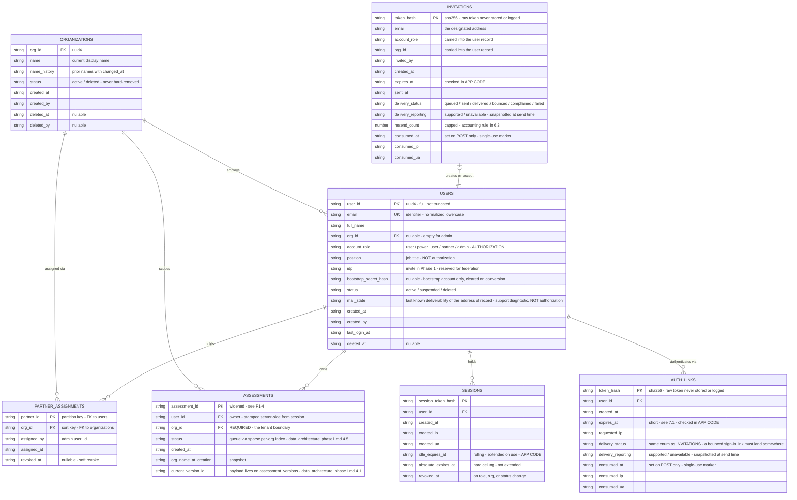
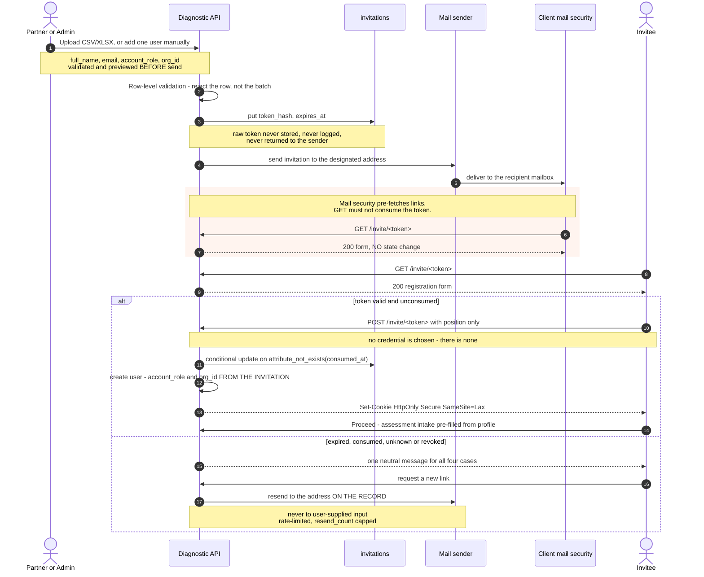
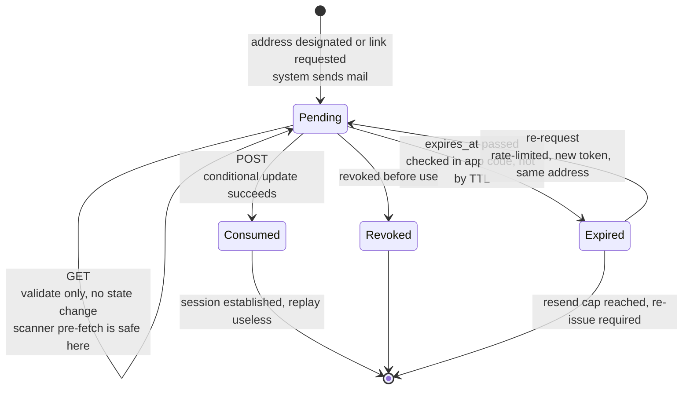
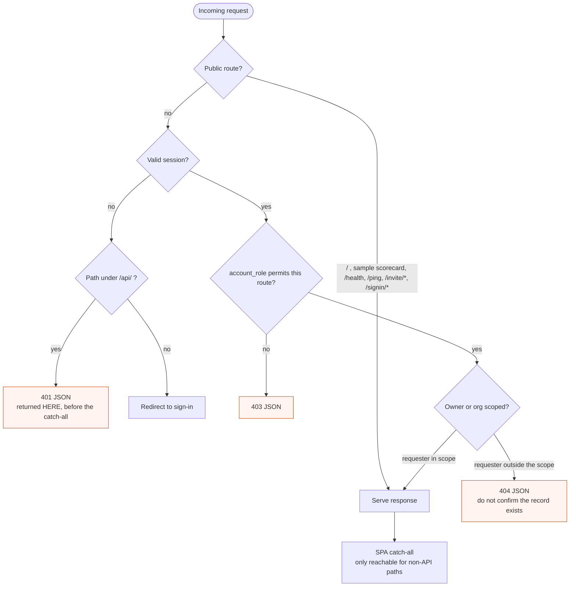

# Authorization Model — Phase 1 Specification

**Date:** 4 August 2026
**Status:** DRAFT SPECIFICATION — normative for Phase 1 implementation; §14 lists points not yet decided
**Verified against:** commit `cbfa830` (branch `main`) for all current-state statements.
**§8.2 and §9 are stale against the running code.** The application has moved since `cbfa830` —
notably the voice scoring path, which is why `data_architecture_phase1.md` **D-1** (BLOCKING) and
**D-8** do not appear in §9. Treat §9 as sized against `cbfa830`, and re-verify before sizing Phase 0
from it
**Scope:** Access control for the AI Readiness Diagnostic — identity, roles, tenancy, isolation, and
the invitation and session lifecycle. Covers the topics recorded as open in `architecture_topics.md` §2.

**Conventions.** **MUST** / **MUST NOT** are requirements on the implementation. **Phase 1** marks
scope for the current build; **Deferred** marks a later phase. Statements under "Current" describe the
system as built and are verifiable against the referenced code. §13 is a parking area and is **not
normative**.

**Supersedes** the access-control review of 3 August, whose analysis was folded into this document and
whose finding identifiers (`P0-*`, `P1-*`, `P2`) are preserved in §9.

---

## 1. Identity model

**Every account — `user`, `power_user`, `partner` and `admin` alike — is created by email invitation
and authenticates by possession of the invited mailbox. The system stores no passwords and requires
no second factor.**

Phase 1 uses exactly one identity mechanism. There is no federated identity provider, no directory
integration, and no credential store. The only external dependency for authentication is outbound
mail.

| Property | Phase 1 |
|---|---|
| Account creation | Email invitation only, issued from within the application |
| Authentication factor | Possession of the mailbox, proven by a single-use sign-in link |
| Stored secret | **None.** No password, no password hash, no complexity policy, no lockout policy |
| Session | Server-side record, rolling expiry, revocable (§7) |
| Second factor | **None, for any role.** An emailed code is not an independent factor (§1.1); an independent factor is Deferred (§12.1) |
| Account recovery | Identical to sign-in — a new link to the address of record. There is nothing to reset |
| Federated identity | Deferred (§12.1) |
| Exception | The bootstrap account, once, at first deployment (§5) |

The `idp` attribute on the user record (§4) carries the value `invite` for every Phase 1 account. It
exists so that a later migration to a federated provider is additive rather than structural.

### 1.1 Consequences that are normative elsewhere

**A second factor delivered by email is not a second factor.** When possession of the mailbox is the
first factor, a code sent to that same mailbox proves the same thing twice. Email one-time codes are
therefore excluded from this specification: they add a delivery round-trip to every sign-in and no
assurance. Any second factor worth adding must run on an independent channel, which is Deferred.

**All accounts are single-factor, including the two that read across organizations.** `partner` and
`admin` hold cross-organization reach on the strength of one mailbox. This is an accepted Phase 1
risk, not an oversight; the compensating controls are the staff-specific rules in §6.5, the shorter
staff session and link lifetimes in §7.1, and the notification requirement in §6.5 rule 4. The
residual that remains after those is stated in §11.1 and §11.2, and the acceptance is recorded as
open point **B**.

**Mail is a single point of failure for all access.** With no independent authentication path and no
stored credential, an undelivered message or an unverified sender domain blocks all provisioning and
all sign-in, for internal accounts as well as client accounts. Mail sender configuration is on the
critical path (§12.2), and the bootstrap account (§5) is the system's only break-glass entry and
**MUST** be retained.

**Session lifetime is the whole of authentication persistence.** With no credential to re-enter, an
expired session means a new mail round-trip. Lifetimes in §7.1 are therefore functional requirements,
not hardening parameters.

---

## 2. Roles

| Role | Population | Definition |
|---|---|---|
| `user` | Client executive, invited | Takes an assessment; sees their own results |
| `power_user` | Client executive, designated | A `user` that additionally sees all results in its own organization |
| `partner` | DXC staff | Reads and approves reports across assigned organizations; manages the people in them |
| `admin` | DXC staff | Manages organizations, partners and admins; **reads no reports** |

`partner` exists in the product today as a concept — the review dashboard, `partner_approved`,
`partner_review_priority` — with no enforcement. `admin` is new.

All four roles authenticate identically (§1). Roles differ in authorization only.

`user` is the default for every client account. `power_user` is an explicit elevation, never a
default, and never inferred from `position` or any other attribute.

---

## 3. Capability matrix

**Normative, and it is the target matrix — not the Phase 1 matrix.** Any capability not listed is
denied. The `power_user` column is the one difference: §12.1 defers that role, so no account holds it
in Phase 1 and every client account is created as `user`. The column is specified here rather than
added later because deferring the role must not mean deferring the decision about what it may read;
implementing it later then alters no existing record and revokes no existing permission. §8.1 carries
the same distinction and is labelled the same way.

| Capability | `user` | `power_user` | `partner` | `admin` |
|---|:--:|:--:|:--:|:--:|
| Submit an assessment for self | ✓ | ✓ | — | — |
| Read own reports | ✓ | ✓ | ✓ | — |
| Read all reports in own organization | — | ✓ | — | — |
| Read reports across assigned organizations | — | — | ✓ | — |
| **Read any report** | — | — | — | **MUST NOT** |
| Approve or send back a report | — | — | ✓ | — |
| Add users to an organization | — | — | ✓ | ✓ |
| Revoke an unconsumed invitation | — | — | ✓ own orgs | ✓ |
| Grant or revoke `power_user` | — | — | ✓ | — |
| Rename an organization | — | — | ✓ | ✓ |
| Re-send a sign-in link to a `user` / `power_user` | — | — | ✓ | ✓ |
| Suspend or restore a `user` / `power_user` | — | — | ✓ | ✓ |
| Create organizations | — | — | — | ✓ |
| Create partners and admins | — | — | — | ✓ |
| Link or unlink a partner to an organization | — | — | — | ✓ |
| Re-send a sign-in link to a `partner` / `admin` | — | — | — | ✓ |
| **Obtain, set or view any authentication secret** | — | — | **MUST NOT** | **MUST NOT** |
| **Change the email address on a `partner` / `admin` account** | — | — | **MUST NOT** | **MUST NOT** |
| Read the audit log | — | — | — | ✓ |

Constraints implied by the table:

- **Report approval is a `partner` capability.** The delivered product commits to a human review step
  before the client receives the fuller output; that step is authorized here and nowhere else.
- **`power_user` is granted by `partner`, not by `admin`.** An `admin` cannot read reports and
  therefore **MUST NOT** control who can.
- **Re-sending a sign-in link is dispatch, not access.** The link is delivered to the address of
  record and is never returned to, or visible to, the initiator (§6.7). This is what keeps a support
  action from being an impersonation capability — see §11.1.
- **The staff address is not editable by anyone.** With mailbox possession as the sole factor, an
  address change on a staff account is equivalent to a credential handover. Replacement is by
  suspension and re-invitation (§6.5 rule 2).
- **Suspension is the account-control lever, not credential manipulation.** There is no credential to
  manipulate.

---

## 4. Data model



`ORGANIZATIONS`, `USERS`, `PARTNER_ASSIGNMENTS`, `INVITATIONS`, `AUTH_LINKS` and `SESSIONS` are new
tables. `ASSESSMENTS` replaces the existing `ai-readiness-diagnostic-sessions` table.

**It is neither additive nor a rewrite: the table is new and empty.** An earlier revision of this
paragraph said `ASSESSMENTS` is the existing table with attributes added, and a later one said the
opposite — that versioning forces a genuine backfill, because `store.py:88` serializes the whole
assessment into a single `doc` string and DynamoDB cannot split an attribute in place. **Decided
7 August 2026: the legacy table holds demo and test records only and is abandoned, not migrated**
(`data_architecture_phase1.md` §16). There is no item to add attributes to and none to rewrite. Every
record in `ASSESSMENTS` is written by the new path in its final shape, carrying `org_id` and `user_id`
from the first write.

**There is therefore no tenant backfill in §12.2 Phase 2.** What that phase does is create the table
with tenancy in it, which is the same act as creating the version chain — one piece of work, not two
that must be co-scheduled. The `SHOULD`-execute-as-one-pass rule this paragraph used to carry, and the
conditions for splitting it, are both retired; `data_architecture_phase1.md` §4.4 amendment 2 records
what replaced them.

The attribute-level shape of `ASSESSMENTS`, its indexes and its version chain are specified in
`data_architecture_phase1.md` §4.1 and §4.4, which is normative for keys, indexes, versioning and
concurrency. This diagram carries only what authorization reads.

**Delivery state is carried on both token tables, not just on invitations.** `AUTH_LINKS` previously
had no delivery attributes at all, which left a bounced sign-in link with nowhere to land: the
executive cannot get in and support has nothing to read. Both tables now carry `delivery_status` and
`delivery_reporting`, and `USERS` carries `mail_state` — the last known deliverability of the address
of record, so the diagnosis survives the token's expiry. `mail_state` is a support signal and
**MUST NOT** be read as an authorization input; a bouncing address is not a suspended account (§3).
The state machine and the `delivery_reporting` snapshot rule are in `../specs/outbound_mail_transport.md`
§3.2. **Indexes** on these attributes are not specified here — `provider_message_id` and the GSI that
serves the delivery webhook belong to `data_architecture_phase1.md` §4.6.

Constraints the diagram cannot express:

- **No account holds a password.** `bootstrap_secret_hash` **MUST** be null for every account except
  the bootstrap account, and **MUST** be cleared on that account's conversion (§5).
- **`org_id` on an assessment is mandatory.** Organization scoping **MUST NOT** be computed by
  joining through the owning user, which fails when a user changes organization. The tenant boundary
  is denormalized onto the record it protects.
- **An organization is an entity, not a string.** `company_name_raw` is free text captured at intake
  and will not group reliably — spelling, legal suffix and subsidiary naming all vary between two
  executives at the same client. A tenant boundary built on it silently fails to separate, or
  silently merges. `org_id` is assigned at invitation, never inferred from submitted text.
- **A partner's organization reach lives in `PARTNER_ASSIGNMENTS`, not on the user record.** The link
  is a grant: it records who created it and when, and is revocable without rewriting the partner.
- **`org_id` on the user record is singular.** One attribute **MUST NOT** carry two meanings.
- **DynamoDB does not enforce uniqueness on a GSI.** Email uniqueness **MUST** be enforced by a
  companion reservation item keyed on `email_normalized`, written with the user record in one
  `TransactWriteItems` (`data_architecture_phase1.md` §4.3). The alternative of keying `users` on the
  normalized email is closed: this table is keyed on `user_id`, and an account's address survives its
  own normalization rules better than a partition key does.
- **`email` on a `partner` or `admin` record is immutable** (§6.5 rule 2). No application route
  updates it.
- **Sessions are server-side.** Access **MUST** be revocable on role change, organization change and
  suspension; a stateless token cannot satisfy this without a denylist.

---

## 5. Bootstrap

The single exception to §1, applying once per deployment.

```
Deploy → one-time bootstrap secret, generated at deploy time
       → first sign-in with that secret is the ONLY password-style authentication in the system
       → the operator binds a real mailbox address on an allowlisted domain
       → bootstrap_secret_hash is cleared; the account converts to link-based authentication
       → audit entry: bootstrap_admin_activated
```

1. The bootstrap secret **MUST** be generated at deploy time and **MUST NOT** be committed — not in
   Terraform variables, not in the repository, not in state files.
2. Conversion **MUST** be enforced server-side. Until a mailbox is bound, every route except the
   conversion route returns 403.
3. The bootstrap secret is single-use. `bootstrap_secret_hash` **MUST** be cleared on conversion, and
   **MUST NOT** be re-issuable through any application route.
4. After conversion the account is an ordinary `admin` and authenticates as in §6.7.
5. Once other admin accounts exist, the bootstrap account is suspended, not deleted (§10 rule 6).
6. Re-running bootstrap against a deployment that already has an active admin **MUST** fail rather
   than mint a second privileged account.

---

## 6. Invitation workflow

Applies to all roles.

### 6.1 Flow



Accepting an invitation both creates the account and establishes the first session. No separate
sign-in step follows registration.

**Issuance rules.** A mistyped address does not bounce harmlessly here — it delivers a working
credential to a stranger, because the link is the whole of authentication (§1). Therefore:

1. **Confirm before send.** The designated address **MUST** be displayed for confirmation, and the
   send **MUST** be a distinct action from entering it.
2. **Domain mismatch MUST be warned on.** Where the target organization has an expected mail domain,
   an address outside it raises a warning at the confirmation step. This is advisory for client
   invitations and a hard server-side block for staff (§6.5 rule 1).
3. **The issuer never handles the link.** Out-of-band delivery — chat, forwarded mail, copy-paste —
   is not supported, and the raw token is not returned to the sender (§6.3).
4. **Unconsumed invitations are revocable**, and revocation is immediate rather than a wait for
   expiry.
5. **Delivery status is visible to the issuer** (`sent` / `delivered` / `bounced` / `complained`), so
   that a failure to reach the mailbox is distinguishable from a recipient who has not yet clicked.

### 6.2 Token lifecycle

Applies to invitation tokens and to sign-in links alike.



### 6.3 Token rules

Normative for `INVITATIONS` and `AUTH_LINKS`. With no second factor anywhere in the system, a live
token is equivalent to a session; these rules are the whole of what protects one.

**Tokens MUST NOT be consumed on `GET`.** Corporate mail security rewrites and pre-fetches URLs in
inbound mail — Mimecast, Proofpoint and Microsoft Defender for Office 365 all do this by default, and
client executives sit behind exactly that class of gateway. A token consumed on first request is
burned by the recipient's own scanner before the recipient clicks. `GET` validates and renders. `POST` consumes, via a conditional update on
`attribute_not_exists(consumed_at)`.

**`expires_at` MUST be checked in application code on every validation.** DynamoDB's native TTL is
garbage collection, not enforcement — items are deleted within roughly 48 hours of the timestamp, not
at it. That sweep lag exceeds the entire validity window of a sign-in link, so a TTL-expired but
un-swept token remains readable. The TTL attribute is cleanup only. The same rule applies to
`SESSIONS`.

**Tokens MUST carry at least 128 bits of entropy**, from a cryptographically secure source. See
**P1-4** for what a truncated identifier costs.

**Raw tokens MUST NOT be stored, logged, or returned to any party other than the mailbox owner.**
Only `sha256` hashes are persisted. Tokens **MUST NOT** appear in application logs, access logs,
audit entries, or console output.

**The link base MUST come from configuration (`AIDIAG_PUBLIC_BASE_URL`), never from the request
`Host` header.** Deriving it from the request means host-header injection yields an
attacker-controlled authentication link — and under §1 the link *is* the whole of authentication. A
non-`https` value **MUST** be refused when `AIDIAG_ENV=production` (**P0-1**).

**Click tracking MUST be disabled on every message carrying a token.** Open- and click-tracking
rewrite the URL to route through the provider's domain, which puts a live single-use credential
through a third party and into that provider's logs, and breaks the sender-domain match a suspicious
recipient checks (§6.1). On SES this is a per-configuration-set setting, not a per-message one — see
`../specs/outbound_mail_transport.md` §3.6.

**Re-request MUST exist and MUST be rate-limited.** An executive recipient will routinely miss a
short window; expiry without a self-service path produces support tickets, not security. The
expired-link page offers a new token, sent to the address already on the record. The request **MUST** be keyed off the expired token or an
authenticated context and **MUST NOT** accept an address from the caller. Limits apply per target
account and globally; `resend_count` is capped, after which re-issue is required.

**What increments `resend_count`, stated because the cap is otherwise unimplementable.** It counts
deliberate resends and delivery-failure resends — one per send the *issuer* asked for. It is **not**
incremented by an idempotent re-upload (§6.4), because one accidental double upload would otherwise
burn the cap for every row in the file at once; and **not** by a transport-level retry of the same
message, which is invisible above the mail interface. The full interaction table, including which
re-upload outcomes re-send the existing token versus mint a new one, is
`../specs/outbound_mail_transport.md` §3.7. Counting only holds across token generations if the
invitation chain has a stable identifier — `invitation_id` in `data_architecture_phase1.md` §4.6.
Without it a re-request creates a new item, `resend_count` restarts at zero, and this cap never binds.

**Responses MUST NOT disclose account existence.** Expired, consumed, unknown and revoked tokens
return one neutral message. A sign-in request for an unknown address returns the same response as one
for a known address. Detail goes to the audit log, not the response.

### 6.4 Bulk upload

- **Row-level validation with a preview step.** A malformed row **MUST NOT** fail the batch, and
  **MUST NOT** be preceded by partial sending.
- **Staff roles MUST be rejected in uploaded files.** Any row requesting `partner` or `admin` is
  refused; those accounts are created individually under §6.5.
- **Re-upload MUST be idempotent.** The same list twice creates neither duplicate accounts nor a
  second live invitation per address.

### 6.5 Staff invitations

A client invitation grants access to one person's own results. A staff invitation grants access to
every report in an organization, or to the platform itself. Because Phase 1 has no second factor for
any role (§1), these rules are the only thing that distinguishes the two. When `account_role` is
`partner` or `admin`:

1. **Domain allowlist.** Staff invitations **MUST** be restricted server-side to approved DXC domains.
   The allowlist is configuration, not user input, and changing it is an audited deployment action.
2. **The address is immutable after acceptance.** No application route changes the email on a staff
   account (§3). Replacement is by suspension and re-invitation, leaving both events in the audit
   log. This is what makes "the address of record" a trustworthy destination in §6.7, and with
   mailbox possession as the sole factor it is what stops an address change from being a silent
   account handover.
3. **Staff roles are created individually**, never through bulk upload (§6.4).
4. **Out-of-band notification.** Staff account creation, role change, address binding, suspension,
   restoration and partner↔organization linking **MUST** notify a security or operations alias and
   all existing admins, in addition to writing an audit entry. This is the control carrying §11.1;
   without it the separation-of-duty property is enforced by nothing.
5. **Staff sessions and links are short-lived** (§7.1). A staff session is not a convenience surface.

### 6.6 Authentication precedes the assessment

Authentication **MUST** complete before an assessment begins. This removes the need to merge anonymous
responses into a later-identified account, to determine ownership of pre-consent data, and to
reconcile a mismatch between the authenticated address and a submitted one.

The public sample scorecard path is retained so the product can be demonstrated without an invitation
(§14, open point **F**).

### 6.7 Sign-in and account recovery

There is no credential to reset, so sign-in and recovery are the same operation.

1. **Sign-in issues a single-use link to the address of record.** The requester supplies an address;
   the system sends a link only if an active account matches, and returns an identical response
   either way (§6.3).
2. **Staff-initiated re-send is dispatch only.** A `partner` or `admin` may trigger a sign-in link for
   an account they administer, as a support action. The link **MUST** go to the address stored on that
   account, **MUST NOT** be returned in the response, and **MUST NOT** be displayed in any console.
   The initiator gains nothing they did not already hold.
3. **The address is never a parameter of a staff-initiated re-send.** It is read from the account
   record.
4. **Consuming a link establishes a session** subject to §7.1.
5. **Consuming a link does not revoke existing sessions**, so that a re-send cannot be used to force
   another account offline. Suspension (§3) is the mechanism for removing access.
6. **Both the request and the consumption emit audit entries**, and the account holder is notified at
   the address of record on staff-initiated re-sends.
7. **Sign-in requests are rate-limited per target address and per initiator**, so that the capability
   cannot be used to flood a mailbox or to probe for valid addresses.

---

## 7. Sessions

### 7.1 Lifetimes

| | Client accounts (`user`, `power_user`) | Staff accounts (`partner`, `admin`) |
|---|---|---|
| Idle expiry | 30 days, rolling — extended on each authenticated request | 12 hours, rolling |
| Absolute expiry | 90 days — not extended | 7 days — not extended |
| Sign-in link validity | 60 minutes | 15 minutes |
| Invitation validity | Open point **H** | Open point **H** |
| Re-authentication | New link to the address of record | New link to the address of record |

Both expiries **MUST** be enforced in application code (§6.3). A session is valid only while
`idle_expires_at` and `absolute_expires_at` are both in the future and `revoked_at` is unset.

The client-side idle window is a functional requirement, not a hardening parameter: an assessment runs
20–26 minutes, **MUST** survive a page refresh, and the scorecard is returned to later.

**The staff windows are a compensating control, and are short deliberately.** In the absence of a
second factor they are the main limit on how long a compromised mailbox or a stolen cookie yields
cross-organization read access. They **MUST NOT** be relaxed to match the client figures.

### 7.2 Session rules

1. **Session cookies are `HttpOnly`, `Secure`, `SameSite=Lax`**, and **MUST NOT** be issued over
   plain HTTP (**P0-1**).
2. **Sessions are revoked** on role change, organization change, suspension, deletion and partner
   assignment revocation.
3. **A session identifier is issued fresh on every sign-in** and never revived; consuming a link
   creates a new session record rather than extending an expired one.
4. **Session identifiers are stored hashed**, and are subject to the same non-disclosure rules as
   tokens (§6.3).
5. **An account holder can list and revoke their own sessions**, which is the only self-service
   remedy available when there is no credential to change.

---

## 8. Route authorization

### 8.1 Target matrix

| Route | public | `user` | `power_user` | `partner` | `admin` |
|---|:--:|:--:|:--:|:--:|:--:|
| `/`, sample scorecard, `/health`, `/ping` | ✓ | ✓ | ✓ | ✓ | ✓ |
| `GET /invite/<token>`, `GET /signin/<token>` | ✓ | — | — | — | — |
| `POST /api/auth/request-link` | ✓ (rate-limited) | — | — | — | — |
| `GET /api/questions` | — | ✓ | ✓ | — | — |
| `POST /api/assess` | — | ✓ own | ✓ own | — | — |
| `GET /api/me/assessments` *(new)* | — | ✓ own | ✓ own | ✓ own | ✓ own |
| `GET /api/org/{org_id}/assessments` *(new)* | — | — | ✓ own org | ✓ if assigned | 403 |
| `GET /api/scorecard/{id}/*.pdf` | — | ✓ if owner | ✓ if same org | ✓ if assigned | 403 |
| `/review`, `GET /api/review/*` | — | — | — | ✓ assigned only | 403 |
| `POST /api/review/{id}/decision` | — | — | — | ✓ assigned only | 403 |
| `POST /api/admin/users` (invite, bulk upload) | — | — | — | ✓ own orgs | ✓ |
| `POST /api/admin/organizations` | — | — | — | — | ✓ |
| `POST /api/admin/partners`, partner↔org linking | — | — | — | — | ✓ |
| `GET /api/admin/audit` | — | — | — | — | ✓ |
| `GET /api/fixture/{name}` | — | — | — | ✓ | ✓ |
| `POST /api/mail/events/{secret}` *(new)* | ✗ *see below* | — | — | — | — |
| `/api/debug*` | **removed** | | | | |

`/api/review/*` **MUST** filter by the caller's active partner assignments. It currently returns every
organization's assessments to any caller (`evaluation_suite.md:512`).

**`POST /api/mail/events/{secret}` is network-reachable but not public in the authorization sense.**
It is the transport's delivery-event callback, so it has no session and no role — the caller is a
provider, not a principal, and the column above is `✗` rather than `✓` for that reason. It is
authenticated by *payload*, and **MUST** carry two independent gates: a shared secret in the path,
compared with `hmac.compare_digest`; and provider signature verification, with the signing-certificate
host matched against an exact pattern rather than a substring, since a look-alike host is the classic
bypass. Both are required. Without them the route is a status-forgery hole — anyone could mark an
invitation `bounced` and drive the issuer into a resend loop. It **MUST** be registered above the SPA
catch-all (**P1-2**). Handler semantics — idempotency, status precedence, and returning 200 for
deliberately ignored events — are in `../specs/outbound_mail_transport.md` §3.2.

### 8.2 Current exposure

Every route in `app/api.py` as built. No route is gated.

| Route | Method | Exposure today |
|---|---|---|
| `/` | GET | Public — correct |
| `/api/questions` | GET | Public |
| `/api/assess` | POST | Public — runs 4 model calls, writes a record |
| `/api/fixture/{name}` | GET | Public — runs 4 model calls, writes a record |
| `/review` | GET | Public — partner dashboard |
| `/api/review/queue` | GET | Public — every prospect, every score |
| `/api/review/{id}` | GET | Public — full scorecard and reasoning |
| `/api/review/{id}/decision` | POST | Public — mutates approval state |
| `/api/scorecard/{id}/*.pdf` (5 routes) | GET | Public — deliverable PDFs |
| `/health`, `/ping` | GET | Public — correct |
| `/api/debug`, `/api/debug/aws` | GET | Public — AWS account id, partial access key, live model invoke |
| `/{path:path}` | GET | Public SPA catch-all |

PII stored per assessment, unencrypted at the application layer and unassociated with any account:
`prospect_name`, `prospect_email`, `prospect_role`, `company_name_raw`, `company_website`,
`hq_country` (`app/models.py:39`).

### 8.3 Request authorization path

Authorization **MUST** resolve, and **MUST** return JSON for `/api/*`, before the SPA catch-all is
reached (**P1-2**).



"Valid session" means `idle_expires_at` and `absolute_expires_at` are both in the future,
`revoked_at` is unset, and the account `status` is `active` — checked on every request. There is no
additional factor gate; §1 states why.

---

## 9. Findings this specification depends on

Verified against `cbfa830`. Identifiers preserved from the superseded access-control review.

### P0 — blocking external exposure

**P0-1 — No TLS in the stack.** No ALB, ACM certificate, CloudFront or Route 53 record exists in
`terraform/`. The ECS task runs with `assign_public_ip = true` and a security group opening port 8080
to `0.0.0.0/0` (`terraform/security.tf:14`). Traffic is plain HTTP to a raw public IP. Sign-in links
and session cookies cannot be shipped over plain HTTP: the token is readable in transit and `Secure`
cookies will not be set. With no second factor, an intercepted link or cookie is unrestricted access.
Prerequisite for all of §1.

**P0-2 — Review dashboard and its mutation endpoint are unauthenticated.** `/review`,
`GET /api/review/queue`, `GET /api/review/{id}` and `POST /api/review/{id}/decision` require nothing.
Any caller can enumerate every assessment — organization, score, tier, validation flags, per-dimension
reasoning — and can approve or send back any scorecard. Closable independently of §1 by an interim
gate.

**P0-3 — Unauthenticated spend amplification.** `/api/fixture/{name}` and `/api/assess` each execute
four sequential model calls and write a record into the review queue, with no auth and no rate limit.
`/api/fixture/{name}` is a `GET`, so a crawler, link scanner or chat unfurl triggers it; the deployed
task sets `AIDIAG_FORCE_LLM=true`.

**P0-4 — `/api/debug/aws` leaks infrastructure detail.** Returns the AWS account id, the first 10
characters of the active access key, configured model IDs, and the result of a live model invoke
(`app/api.py:108`).

### P1 — blocking the authorization implementation

**P1-1 — `CORSMiddleware(allow_origins=["*"])` is incompatible with cookie authentication.**
`app/api.py:37`. The wildcard cannot be combined with credentialed requests. Reflecting the request
origin instead opens a CSRF path. An explicit origin allowlist with `allow_credentials=True` is
required.

**P1-2 — The SPA catch-all swallows API 401s.** `@app.get("/{path_name:path}")` (`app/api.py:334`)
returns `index.html` for any unmatched path. See §8.3.

**P1-3 — No owner field, and the store is scan-only.** The record is
`{id, session, scorecard, created_at, status, partner_note}` (`app/store.py:16`), and `all_records()`
performs a full table `Scan` (`store.py:96`). Per-user, per-organization and per-status access **MUST**
be served by GSIs rather than by scan-then-filter.

**P1-4 — Assessment ids are 40 bits and act as bearer tokens.** `uuid.uuid4().hex[:10]`
(`app/api.py:67`) yields ~1.1 × 10¹² values, and no route checks authorization, so the id is the only
protection on a scorecard PDF. The same truncation **MUST NOT** be applied to invitation tokens,
sign-in links or session identifiers (§6.3).

**P1-5 — No audit log.** Required by §3, §6.5, §6.7 and §10 rule 8. The `AuditLogEntry` schema exists
in `companion_05:964-993`.

### P2 — carried into the design

- **No client-side answer persistence.** Answers live only in React state; a refresh loses them. This
  interacts with §7.1: the session survives a refresh, but the answers do not.
- **Consent is per-submission, not per-account.** `ConsentRecord` is captured with each assessment
  (`app/models.py:52`). Accounts introduce a second consent surface — terms accepted at registration —
  which **MUST NOT** be conflated with C-1…C-5. **Decided 7 August 2026**, and this is the position of
  record: `data_architecture_phase1.md` §8 briefly stated the opposite and now keys `consent_records`
  on `assessment_id` to match. That document is normative for the shape and for what per-submission
  costs — a blanket withdrawal is a batch, not a single write.
- **Erasure surface.** A data-subject request currently touches one record. Under this specification
  it spans users, invitations, sign-in links, sessions, assessments, audit entries and cached PDFs.
  Parked at §13.1.

---

## 10. Enforcement rules

1. **`account_role` and `org_id` are written from the invitation, server-side.** They **MUST NOT** be
   accepted from a form field, a request body, or an uploaded file.
2. **`position` is not `account_role`.** Neither attribute is derived from the other. `position` is
   the same data as the existing `Submission.prospect_role` and may pre-fill assessment intake.
3. **`user_id` and `org_id` on a new assessment are taken from the session**, never from the request
   body.
4. **Owner-scoped and organization-scoped misses return 404, not 403.** A 403 confirms record
   existence and is an enumeration oracle (**P1-4**).
5. **Organization renames do not rewrite history.** `org_name_at_creation` keeps a reissued document
   consistent with the one already delivered; `name_history` preserves the audit trail.
6. **Deletion is a status, not an absence.** No record is hard-removed by an operational path. Every
   read path filters `status != deleted` centrally. *(Phase 1 rule. It is not the whole answer where a
   right to erasure applies — see §13.1.)*
7. **Sessions are revoked on any authorization change** (§7.2 rule 2).
8. **Every capability in §3 emits an audit entry**, as do token issue, token consumption, and every
   authentication outcome.

---

## 11. Residual risks

### 11.1 Separation of duty between `admin` and report access

`admin` **MUST NOT** read reports (§3). Under email-only, passwordless, single-factor identity (§1)
this property holds against one attack path and is detected, not prevented, on another.

| Path | Control | Status |
|---|---|---|
| `admin` obtains an existing `partner`'s access | There is no credential to manipulate (§1). A re-send delivers a link to the address of record only (§6.7 rules 2–3), and §6.5 rule 2 makes that address immutable, so no application route directs a `partner`'s access to an address the `admin` controls | **Prevented**, contingent solely on the integrity of the partner's mailbox — there is no second factor behind it |
| `admin` creates a new `partner` account at an address they control, links it to an organization, and reads the reports | §6.5 rules 1, 2 and 4 — domain allowlist, immutable address, out-of-band notification to all admins and a security alias | **Detected, not prevented** |

Removing stored credentials strengthens the first row materially: it is no longer a question of who
may invoke a reset, because no operation sets an authentication secret for another account. It does
not make the row unconditional — mailbox compromise defeats it, and nothing in this system detects
mailbox compromise (§11.2).

The control carrying the second row is notification (§6.5 rule 4), not the audit log. An audit log is
read after an incident is suspected; notification is what creates the suspicion. If notification is
not implemented, the property is not enforced by anything.

Federated staff identity closes the second path, because creating a usable partner identity would then
require creating a directory object rather than a row in the users table — and it would supply the
second factor the first row lacks. This is the upgrade path, parked at §13.2; adopting it requires no
structural change, as `idp` already exists on the user record and §6.5 rules 1–2 become redundant
rather than incorrect.

### 11.2 Mailbox compromise is total compromise

Possession of the mailbox is the sole authentication factor for every account (§1). A compromised
mailbox therefore yields full access to that account, and mailbox compromise is not detectable by this
system. For `partner` and `admin` that means cross-organization report access, or platform
administration, on the strength of one mailbox.

What bounds it in Phase 1:

- Sign-in links are single-use and short-lived — 15 minutes for staff (§7.1).
- Staff sessions expire in 12 hours idle and 7 days absolute (§7.1), so access does not persist
  quietly.
- Staff addresses are restricted to allowlisted DXC domains (§6.5 rule 1), placing them inside
  corporate mail controls rather than on arbitrary providers.
- Privileged account events notify all admins out of band (§6.5 rule 4).

What does not bound it: nothing else in this system. The residual is accepted for Phase 1 and recorded
as open point **B**. An independent second factor for staff is the first item in the Deferred column
of §12.1 for this reason.

### 11.3 Scope of the model

Four roles, an organization entity and partner assignments constitute more implementation than a
three-role model without tenancy. The delivery window is met by the scope cut in §12.1, not by the
model being smaller. Removing stored credentials and second factors offsets part of it: no hashing
parameters, no complexity policy, no lockout policy, no reset flow, no enrolment or recovery flow, and
none of the associated test surface.

---

## 12. Phasing

### 12.1 Phase 1 scope

| | Phase 1 | Deferred |
|---|---|---|
| Roles | `user`, `partner`, `admin` | `power_user` |
| Identity | Email invitation, passwordless, all roles | Entra ID for staff (§13.2) |
| Second factor | None (§1) | Independent second factor, staff first (§11.2) — subsumed by §13.2 |
| Organizations | Table, creation, assignment | Rename, name history |
| Partner scope | Assigned organizations enforced on `/review` | Cross-organization reporting views |
| Invitations | Manual single-user add | CSV/XLSX bulk upload |
| Admin console | Create organization, create partner, link | Full user management UI |
| Audit | Entries written for every §3 capability | Audit viewer UI |
| Deletion | Soft delete on all paths (§10 rule 6) | Erasure (§13.1) |

`power_user` defers without blocking: every client account is created as `user`, and adding
organization-wide read later alters no existing record and revokes no existing permission.

Bulk upload defers without blocking: single-user add covers a customer-zero population, and the
upload path carries the §6.4 validation and idempotency requirements for no near-term coverage.

**Partner scoping on `/review` does not defer.** The route currently returns every organization's
assessments to any caller (**P0-2**), which is the specific defect a multi-tenant beta would expose.

**Out-of-band notification on staff events does not defer** (§6.5 rule 4). It is the only control
carrying §11.1.

### 12.2 Delivery sequence

| Phase | Work | Blocked on | Effort |
|---|---|---|---|
| **0** | ALB, ACM certificate and **all DNS for `air.dxc.com` as one work item** — the ALB record, plus SES sender verification with its DKIM and DMARC records (`../specs/outbound_mail_transport.md` §2.3). 80→443 redirect, task SG narrowed to the ALB (**P0-1**). Interim gate on `/review` and `/api/review/*` (**P0-2**). Rate limits on `/api/assess` and `/api/fixture/*` (**P0-3**). Remove `/api/debug*` (**P0-4**). | Nothing | 1–2 days infra, 0.5 day app |
| **1** | `users` / `organizations` / `invitations` / `auth_links` / `sessions` tables. Link issuance and consumption, session creation and rolling expiry (§7). Authorization middleware ordered ahead of the SPA catch-all (**P1-2**). CORS restricted to explicit origins (**P1-1**). Cookie hardening. | Phase 0 | 4–6 days |
| **1b** | Sending-limit release out of the SES sandbox, invitation and sign-in templates, the `app/mail/` interface and its SES driver, the delivery-event webhook (§8.1), bounce and complaint handling. Verification and the DNS records themselves are Phase 0. | Phase 0 — the DNS records must be published and verified first. **No longer blocked on an open point:** **E** is closed (§14) | 2–3 days work, ~1 week elapsed |
| **2** | Invitation issue/send/accept, consume-on-POST, expiry in application code, expired-link page with rate-limited re-request. `assessments` created new and empty with `user_id`, `org_id` and its GSIs (**P1-3**) — **no backfill; the legacy table is abandoned** (§4, `data_architecture_phase1.md` §16), and this is the same act as creating the version chain, not a second pass over it. `audit_log` table created here, not in Phase 3 (§10 rule 8 binds from this phase). Assessment ids are 128-bit from the first write (**P1-4**) — width reduces the blast radius; route authorization is what fixes the finding (`data_architecture_phase1.md` §16.3). `GET /api/me/assessments`. Intake pre-fill. | Phase 1b, open point **F**, and open point **I2** in `llm_architecture_and_output_assurance_phase1.md` §6 item 9 — see the note under §14. **What changed on 7 August is scheduling, not the gate:** splitting the backfills would have let tenancy land ahead of the versioning pass, and there is no backfill to split | 5 days |
| **3** | Partner-assignment filtering on `/review`. Extend the existing review surface rather than adding a second dashboard. User and organization management. Staff-event notification (§6.5 rule 4). Audit **viewer and actor index** (**P1-5**); the store itself lands in Phase 2. | Phase 2 | 5–8 days |
| **4** | Rate limits on link request and invitation accept. Session revocation on authorization change. Self-service session listing (§7.2 rule 5). Retention job (`data_architecture_phase1.md` §13) — **not** a TTL sweep; TTL leaves the S3 payloads and rendered PDFs behind. | Open point **C** | 3 days |

**Mail sender verification is elapsed time, not effort, and under §1 it gates all provisioning and all
sign-in.** It is on the critical path alongside **P0-1** and begins in Phase 0 — in the same work item,
because the ALB record and the sender records resolve on the same zone and are one ask of whoever
administers it. The elapsed time is DNS propagation and the SES sandbox release, neither of which
shortens by starting Phase 1 first.

---

## 13. Stage 2 — parked

**Not normative, and not Phase 1 scope.** This section holds work that follows from the model above
but is deliberately not specified yet. Items are recorded here so they are not lost, and each names
what it changes in the normative body when it is taken up. Nothing here is a commitment to a design;
material moved out of this section acquires **MUST** language at that point and not before.

### 13.1 Erasure, and the limits of §10 rule 6

Rule 6 of §10 states that deletion is a status, not an absence. That rule is correct as an operational
constraint and insufficient as a data-protection position — a soft-deleted record is retained
personal data. Where a right to erasure applies, marking a record deleted does not discharge it, and
the rule as written can be read as a claim that it does. Rule 6 governs the operational paths; it does
not govern erasure, and this section is the reason it does not.

What a Stage 2 erasure design has to settle:

- **Scope of a single request.** Erasure spans `users`, `invitations`, `auth_links`, `sessions`,
  `assessments`, `assessment_versions`, cached scorecard PDFs, mail-provider delivery logs,
  application and access logs, and any contribution the assessment made to a peer benchmark corpus.
  Two further scopes did not exist when this section was written and are added by
  `data_architecture_phase1.md` §13: **interview turns and any stored audio**, and **S3 version
  payloads and pinned artifacts**. The benchmark case is the hard one: a contribution that has been
  aggregated may not be individually removable, which is a design constraint on the benchmark rather
  than on this document.
- **What survives erasure, and on what basis.** The audit entry recording the erasure survives it.
  Whether any other audit entry survives, and under which lawful basis, is undecided.
- **Separation from the operational path.** Erasure is a distinct, audited procedure invoked only on
  a legal request, not a capability in §3 and not reachable from the admin console as built.
- **Who authorizes it.** No role in §3 currently holds it. `admin` is the obvious candidate and the
  wrong one on a naive reading, since erasure targets records `admin` cannot read.
- **Retention as the other half.** A retention period that expires records automatically (open point
  **C**) reduces the erasure surface but does not replace it, and the two interact: a record already
  expired by TTL still has to be reported on when a request arrives.
- **Consent interaction.** Withdrawal of consent (C-1…C-5) is not the same event as an erasure
  request and **MUST NOT** be collapsed into one flow.

Cross-references to update when this moves out of Stage 2: §10 rule 6, §12.1 deletion row, §12.2
(erasure tooling was removed from Phase 4 when this was parked), §9 P2 erasure surface, and open
point **G**.

### 13.2 Entra ID for staff identity

The 3 August meeting record settles internal identity on **Entra ID**. Phase 1 deviates from that and
puts `partner` and `admin` on the same email path as client accounts (§1), as a scope cut to meet the
delivery window — recorded as open point **A**, not as a disagreement with the decision. This section
is where the deviation gets repaid.

**What adopting it changes in the normative body:**

| Section | Change |
|---|---|
| §1 | Two identity mechanisms instead of one: Entra for `partner` and `admin`, email link for `user` and `power_user`. The `idp` attribute stops being a constant |
| §6.5 rules 1–2 | Redundant rather than wrong. The directory owns the address, so a domain allowlist and an immutability rule enforced in application code are no longer the controls that matter |
| §11.1, row 2 | Moves from **detected** to **prevented**. Minting a usable `partner` identity would require creating a directory object in the DXC tenant, not a row in the users table |
| §11.2 | Closes for staff. Mailbox possession stops being the staff factor; client accounts are unaffected |
| Open points **A**, **B** | Both resolve. This is the load-bearing point: the DXC tenant already enforces MFA, so adopting Entra answers the staff second-factor question without a separate mechanism. **A** and **B** are not independent decisions |

**What it does not change.** Client accounts stay passwordless email. External executives hold no DXC
credentials, which is the original tension in the 24 July and 3 August records and is not resolved by
picking a staff IdP. Sessions also stay as specified — Entra replaces the sign-in link, not §7.

**What a Stage 2 design has to settle:**

- **Where `account_role` comes from.** Either an Entra group claim, which puts "who is a partner"
  under DXC IT change control and outside this application, or the `users` table as now, with Entra
  authenticating only. The first is stronger and slower; the second keeps §3 intact. Not the same
  decision as adopting Entra, and easy to conflate with it.
- **Protocol and registration.** OIDC authorization code with PKCE against the DXC tenant. One app
  registration per environment, or one registration with a redirect URI per environment — QA and
  production are separate names (§12.2 Phase 0).
- **Dependencies outside the team.** App registration, admin consent, and any Conditional Access
  policy applied to it are DXC IT actions. This is elapsed time, not effort — the same class of
  dependency as mail sender verification, and it should be started on the same basis (§12.2).
- **Break-glass becomes more important, not less.** §5 is the only entry path that survives an
  unreachable tenant or a misconfigured registration, and under two identity mechanisms it is the
  only one that reaches an `admin` account. It **MUST** be retained and its rotation rehearsed.
- **Migration is additive.** Existing staff accounts keep their `user_id`; `idp` flips from `invite`
  to the federated value and email is the join key. No re-invitation and no re-linking of partner
  assignments, provided the directory address matches the address of record — which §6.5 rule 2 is
  what guarantees.
- **Guest and B2B accounts.** Whether client executives could instead be Entra external identities is
  a separate question with a different cost profile, and parking Entra for staff does not park it.

Cross-references to update when this moves out of Stage 2: §1 and its table, §6.5 rules 1–2, §11.1
row 2, §11.2, §12.1 Identity and Second factor rows, and open points **A** and **B**.

### 13.3 Also parked

| Item | Currently referenced from | Note |
|---|---|---|
| Independent second factor, staff first | §1, §11.2, §12.1, open point **B** | Excludes emailed codes by §1.1. Channel undecided, and largely subsumed by §13.2 if Entra is adopted |
| Retention period and automatic expiry | Open point **C**, §12.2 Phase 4 | Interacts with §13.1 |

*Further items go here.*

---

## 14. Open points

Not decided. Each blocks the work named.

| # | Point | Blocks |
|---|---|---|
| **A** | Phase 1 uses email identity for all roles (§1). The 3 August meeting record settles internal identity on Entra ID. The deviation requires explicit confirmation, and a point at which it is repaid (§13.2). | §1, §6.5, §11.1, §13.2 |
| **B** | Formal acceptance of single-factor authentication for `partner` and `admin`, whose reach is cross-organization (§11.2), and the point at which an independent second factor becomes mandatory. Not independent of **A** — adopting Entra answers it (§13.2). | §1, Phase 1 sign-off |
| **C** | Assessment retention period. | Phase 4 TTL, §13.1 |
| **D** | Whether a `power_user` grant requires recorded client authorization in addition to partner action. Disclosure cannot be walked back once a colleague's scorecard has been seen, which is why `user` is the default and elevation is explicit (§2). | §3, Phase 2 |
| **F** | Whether the public sample scorecard path is retained (§6.6). | Phase 2 routing |
| **G** | When erasure leaves Stage 2 (§13.1). Soft delete alone is not a data-protection position, and the beta is client-facing. | §13.1 |
| **H** | Invitation validity window (§7.1). | §6.2, §6.3 re-request design |

**Point E is closed, and its letter is retired rather than reused.** The mail sending mechanism is
**Amazon SES**, sender `no-reply@air.dxc.com` behind a provider-agnostic interface; the decision and
the disqualification of the alternatives are `../specs/outbound_mail_transport.md` §2 and §2.1. The
deciding argument is this document's own §4: Microsoft Graph `sendMail` returns `202 Accepted` and
nothing further, and cannot produce `complained` at all, so it cannot implement the `delivery_status`
that §6.1 rule 5 makes visible to the issuer. Graph is kept as a driver swap, on nobody's critical
path. Letters are not reused, so an external citation of **E** still resolves to this paragraph.

What survives the closure is a *task*, not a decision: administration of the `air.dxc.com` zone, and
the DKIM and DMARC records that make the sender align. That is folded into the §12.2 Phase 0 DNS
work item, not carried here.

**Imported dependency — not a point of this register.** **Phase 2 is blocked on a product decision no
register in this document contains:** open point **I2**, owned by
`llm_architecture_and_output_assurance_phase1.md` §6 item 9. It gates
`data_architecture_phase1.md` §17 **Stage 0a**, and Stage 0a gates that document's Stage 2 — which
*is* §12.2 Phase 2, because creating `assessments` with tenancy and creating it with a version chain
are one act (§4).

**It is one edge, not a chain.** That document's Stages 0b and 1 are independent of **I2** and can
proceed today, so the wait is on the taxonomy reconciliation alone rather than on three stages in
series.

**What changed on 7 August 2026 is narrower than it first looks.** This note used to offer *"split
the backfills and accept the double rewrite rather than wait."* The legacy table is abandoned
(`data_architecture_phase1.md` §16), so there is no backfill to split and that sentence is
withdrawn — but it was a *scheduling* escape, letting tenancy land ahead of the versioning pass, not
a way of proceeding without **I2**. The taxonomy exposure is unchanged: it has always been about
newly written versions, backfilled ones were excluded from comparison in any case, and the first
version written is a real client's, immutable by that document's §5.3 rule 2 and permanently
non-comparable if the taxonomy underneath it is unreconciled. That was true on 6 August and is true
now. **I2's urgency did not move**; `data_architecture_phase1.md` §17 records the escape that does
remain.

`data_architecture_phase1.md` §19 continues this document's lettering at **I**; read it next.

---

## 15. Out of scope

- **Pipeline durability.** Assessments persist only after the full pipeline returns, so a task
  replacement mid-request loses the submission while the client surface reports success. See
  `architecture_topics.md` §7.
- **Multi-tenancy proper** — per-client infrastructure isolation, per-organization encryption keys,
  region pinning. Organizations are a logical boundary in Phase 1 (§4), enforced in application code
  against one table in one region.
- **Residency, consent language and regulatory position.** See `architecture_topics.md` §4.
- **Encryption of assessment PII at the application layer.** See `architecture_topics.md` §5.

**No longer out of scope: voice-session durability.** Answers accumulated client-side and submitted
only at the end, so a dropped call lost the whole interview. Server-side turn append closes it
(`data_architecture_phase1.md` §7 rule 1), subject to that document's **D-8** — the agent must send a
`question_id` before a turn can be stored as anything but prose.

---

*Related: `architecture_topics.md` §2, `workflows_and_data_governance_baseline.md`,
`companion_05_data_schemas.md`, `meetings/2026-08-03_meeting_summary.md` §4.*
