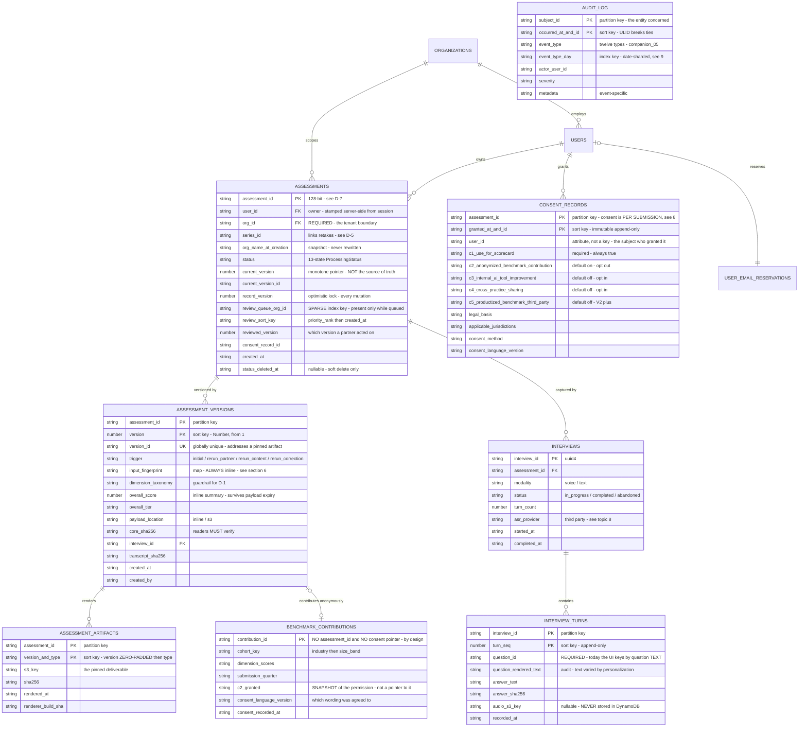

# Data Architecture — Phase 1 Specification

**Date:** 5 August 2026
**Status:** DRAFT SPECIFICATION — normative for Phase 1 implementation; §19 lists points not yet decided
**Verified against:** commit `3fb65ea` (branch `doc/auth-stage1`) for all current-state statements.
Application code has moved since `cbfa830`, the baseline of `authorization_model_phase1.md` — notably
the voice scoring path, which is why **D-1** does not appear there.
**Scope:** What is stored, in what shape, how it changes over time, and what happens under concurrent
writes. Covers the topic recorded as open in `architecture_topics.md` §3, and the storage half of §4.

**Conventions.** **MUST** / **MUST NOT** are requirements on the implementation. **Phase 1** marks
scope for the current build; **Deferred** marks a later phase. Statements under "Current" describe the
system as built and are verifiable against the referenced code. §18 is a parking area and is **not
normative**.

**Relationship to other documents.** `authorization_model_phase1.md` is normative for identity,
roles and tenancy; this document extends its §4 and **MUST NOT** restate its rules differently. **Six
amendments to it are proposed; §4.4 carries the register**, and each is stated where its reasoning
lives. `companion_05_data_schemas.md` is the source of truth for entity
*shapes*; this document is the source of truth for *keys, indexes, versioning and concurrency*. Where
they disagree, §2.3 records it explicitly rather than resolving it silently.

---

## 1. What this document decides

Three things the platform cannot defer past the data model:

1. **Whether the assessment is a blob or an entity model.** It becomes an entity model. The blob is
   why there is no audit log, no versioning and no queryable review queue — one cause, three symptoms.
2. **What a "version" is.** Every pipeline run appends an immutable version. Nothing is overwritten,
   and two versions can be compared and the difference *explained*.
3. **What happens under concurrent writes.** Two documented BLOCKER races close by construction, not
   by convention.

It also gives three homes to data that currently has none: the **email invitation**, the **voice
interview transcript**, and the **audit log**.

---

## 2. Current state

### 2.1 One table, two attributes

| Property | Current | Source |
|---|---|---|
| Table | `${app_name}-sessions`, `PAY_PER_REQUEST`, PITR enabled | `terraform/dynamodb.tf:1-16` |
| Key | Partition key `id` (S). **No sort key** | `terraform/dynamodb.tf:4-9` |
| Indexes | **None.** No GSI, no LSI | `terraform/dynamodb.tf` |
| TTL | **None** | `terraform/dynamodb.tf` |
| Encryption | **No `server_side_encryption` block** — AWS-owned key by default | `terraform/dynamodb.tf` |
| Item shape | Exactly two attributes: `{"id", "doc"}`, where `doc` is the entire assessment serialized to one JSON string | `store.py:88` |
| Reads | `get_item` by id; `all_records()` performs a full paginated `Scan` | `store.py:93`, `:96-106` |
| Writes | `put_item` only. `save = put` — a full-item overwrite | `store.py:87-90` |
| Concurrency control | **None.** No `ConditionExpression`, no version attribute | `store.py` |
| Identifiers | `uuid.uuid4().hex[:10]` — 40 bits | `api.py:67` |

`UpdateItem` and `Query` are already granted in IAM (`terraform/iam.tf:76-77`) and never called.

### 2.2 What follows from the shape

- **No query path except by id.** Every listing is a `Scan`. `GET /api/review/queue` scans the entire
  table on each page load and sorts in Python (`api.py:216-236`).
- **Every partial update is a whole-record rewrite**, and `POST /api/review/{id}/decision` is
  precisely that: `get` → mutate → `save` (`api.py:257-267`). Two partner decisions landing together
  do not merely race on `status` — the loser's **entire assessment** is overwritten.
- **A hard 400 KB ceiling per assessment**, unmonitored, failing after the model spend is already
  incurred (`master_audit_report.md:546`, finding D15).
- **No tenant or subject dimension.** No `org_id`, no `user_id` on any record (`store.py:33-55`), so
  the store cannot satisfy the tenancy boundary `authorization_model_phase1.md` §4 makes mandatory.
- **No version attribute**, despite `companion_05:43-49` placing a monotonic `version` on every entity
  and `:1052` requiring that a historical scorecard's reasoning be reproducible.
- **No audit log, no retention, no delete path** — no `ttl` block, no `DeleteItem` in
  `terraform/iam.tf:72-78`, no delete route — while storing `prospect_name`, `prospect_role` and
  `prospect_email` (`models.py:39-49`).
- **The voice interview is not persisted at all.** `voice_responses` arrives on the request
  (`api.py:83`), is passed to the pipeline (`api.py:202`), is consumed only to derive dimension scores
  (`orchestrator.py:91-94`), and is **never assigned onto `Session`** — which has no field for it
  (`models.py:178-186`). The raw answers die with the request; only `DimensionScore.reasoning`
  survives, so a voice-scored dimension cites evidence that no longer exists.
- **Nothing is stamped.** No build identity, no prompt version, no record of which model actually ran.

### 2.3 Disagreements between documents, recorded not resolved

| # | Disagreement | Position taken here |
|---|---|---|
| 1 | **Storage engine.** `companion_05:1034` recommends PostgreSQL for all prospect-keyed entities. `aws_reference_architecture_and_cost_model.md:44` and the normative `authorization_model_phase1.md` §4 commit to DynamoDB | **DynamoDB.** §3.1 states why, and states honestly that it is a delivery decision. Parked at §18.1 |
| 2 | **Vocabulary.** `companion_05` says `Prospect` / `prospect_id`; the authorization spec says `USERS` / `user_id` and adds `ORGANIZATIONS` | The authorization spec's vocabulary. `prospect_id` ≡ `user_id`; mapped once, here, and not repeated |
| 3 | **Table name.** `ai-readiness-diagnostic-sessions` (`terraform/dynamodb.tf:2`) vs `ai-readiness-sessions` (`deploy/aws/config.sh:11`) — two provisioning paths, different names, different PITR | **D-4** ([`#7`](https://partner-github.dxc.com/SAM-Prime-X/ai-readiness-diagnostic/issues/7)). Terraform is authoritative |
| 4 | **Consent categories.** Five specified (`companion_05:147-166`); four implemented with different names (`models.py:52-58`); C-2 has four spellings across documents | **D-6.** §8 specifies the five |
| 5 | **Consent granularity.** `authorization_model_phase1.md` §11 P2 says per-submission; §8 of this document briefly said per-subject | **Per-submission**, decided 7 August 2026. §8 rule 1 records what that costs — blanket withdrawal is a batch, not one write |
| 6 | **Benchmark linkage.** `companion_05:914,928-931` keeps a `consent_record_reference` on each contribution, linkable *"except via separate audit trail"*; §10 here claims no route back to the subject at all | **No route.** A structural property, not a policy one. The reference is dropped and the C-2 permission snapshotted instead (§10). Deviation from the product schema, taken deliberately |

---

## 3. Design decisions

### 3.1 DynamoDB, and why — stated honestly

Phase 1 uses **DynamoDB**, table per entity.

This is a **delivery decision, not a claim that it is the better technical fit.** The reasoning is
worth writing down accurately, because the opposite is easy to assume from the outcome:

- It is what is deployed. Terraform, IAM and every line of `app/store.py` target it.
- `authorization_model_phase1.md` §4 is normative and DynamoDB-specific. Changing engines means
  reopening a document that was just settled.
- At ~50 client organizations and ~175 interviews per month
  (`aws_reference_architecture_and_cost_model.md`), on-demand DynamoDB is close to free and carries no
  operational burden. RDS means VPC placement, connection pooling from ECS, backups, patching and an
  owner.
- The 19 August demo and 21 August beta are two weeks out.

**Against it, and this is the honest part.** At this volume the workload is join-shaped and
aggregation-shaped, which is what `companion_05:1034` saw. Four consequences are paid for in this
document rather than avoided: the partner review queue is a fan-out instead of a join (§4.5); email
uniqueness needs a reservation table instead of a constraint (§4.3); benchmark cohort averages and
*n* must be precomputed instead of aggregated (§10); and version payloads need S3 offload instead of
a large column (§11). None is unreasonable. All are work that a relational store would not require.

The conditions that should trigger a revisit are recorded at §18.1.

### 3.2 The version model

**An `ASSESSMENT` is the durable subject. Each pipeline run appends an immutable
`ASSESSMENT_VERSION`.** Nothing is overwritten. Comparison is a diff of two versions, and the diff can
say *why* they differ (§6).

**A retake is a new assessment, not a new version.** A person reassessing six months later gets a new
`assessment_id` and a new version chain, linked to the prior assessment by an explicit series
identifier (§4.4, **D-5**). This keeps two very different events from sharing one counter: "we re-ran
the model on the same answers" and "they answered again, six months later".

### 3.3 What versioning is for

Three distinct uses, and the design must serve all three:

1. **Reproducibility.** `companion_05:1052` — "a historical scorecard's reasoning must be
   reproducible." A delivered scorecard **MUST** remain readable exactly as delivered, after the
   question pool, the prompts and the models have all moved on.
2. **Comparison.** The partner send-back path (`api.py:262`) is a request to re-run. Without versions
   there is nothing to compare the re-run against.
3. **Accountability.** A partner approves a *specific* version, not "the assessment, whatever it says
   now."

---

## 4. Entity model, tables and access patterns

### 4.1 The model

**This is the target model. None of it is built** — the current state is §2.1's two-attribute item.
§17 stages the work and §16 cuts over to it — on new, empty tables, with no data carried across; read
any entity here as specified, not as present.

`ORGANIZATIONS`, `USERS` and the token and session tables are specified in
`authorization_model_phase1.md` §4 and are not restated here.

Constraints the diagram cannot express:

- **`org_id` on an assessment is mandatory**, and is denormalized onto the record it protects. It
  **MUST NOT** be computed by joining through the owning user (`authorization_model_phase1.md` §4).
- **`assessments` carries no blobs.** Everything large lives on a version or in S3. This is what
  permits `ALL` projections on its indexes (§4.5).
- **`current_version` is a cache, not the truth** (§5.2).
- **`review_queue_org_id` is absent, not null**, whenever the assessment is not awaiting a decision.
  DynamoDB omits from a GSI any item lacking the index key, which is the whole mechanism of §4.5.
- **Version items are write-once.** Enforced in IAM (§15 rule 6).

### 4.2 Table inventory

Fourteen tables. Seven are specified by `authorization_model_phase1.md` §4 (one of them restructured
here), one is implied by that document's own uniqueness rule, six are new.

| Table | PK | SK | Origin |
|---|---|---|---|
| `organizations` | `org_id` | — | Auth spec |
| `users` | `user_id` | — | Auth spec; gains a sparse `staff_role` index |
| `partner_assignments` | `partner_id` | `org_id` | Auth spec — the key order is what makes §4.5 step 1 a single consistent read |
| `invitations` | `token_hash` | — | Auth spec; three attributes and four indexes added here (§4.6) |
| `auth_links` | `token_hash` | — | Auth spec; one index added here for delivery events (§4.6) |
| `sessions` | `session_token_hash` | — | Auth spec — the key is the *hash*, never a bare identifier (`authorization_model_phase1.md` §7.2 rule 4) |
| `user_email_reservations` | `email_normalized` | — | **Implied, not stated** (§4.3) |
| `assessments` | `assessment_id` | — | **Restructured** from `${app_name}-sessions` (§4.4) |
| `assessment_versions` | `assessment_id` | `version` (N) | New |
| `assessment_artifacts` | `assessment_id` | `<padded_version>#<type>` | New. Separate from the version because artifacts render *after* the version is sealed, and a re-render must not touch an immutable item |
| `interviews` | `interview_id` | — | New (§7) |
| `interview_turns` | `interview_id` | `turn_seq` (N) | New (§7) |
| `audit_log` | `subject_id` | `occurred_at#event_id` | New (§9) |
| `benchmark_contributions` | `contribution_id` | — | New, Phase 2 (§10) |

### 4.3 `user_email_reservations` — required, not optional

`authorization_model_phase1.md` §4 states that a GSI cannot enforce uniqueness and that email
uniqueness therefore needs its own mechanism. This is that mechanism, and it is a table because
DynamoDB has no unique constraint: a conditional `PutItem` on `email_normalized` with
`attribute_not_exists` is the only construct that makes "one account per address" atomic.

A second reason makes it load-bearing rather than tidy: **a GSI is eventually consistent.** An
invitation accepted at the same moment as a self-service sign-in can read an empty index and mint a
second account for one address. The reservation is a base-table conditional write, so it cannot.

Reservation and user creation **MUST** be one `TransactWriteItems` — this is the case where a
transaction *is* a correctness dependency, unlike §5.2 step 5. A stranded reservation with no user
locks an address out permanently.

### 4.4 `assessments` — keys and indexes

| Index | PK | SK | Projection | Serves |
|---|---|---|---|---|
| *(base)* | `assessment_id` | — | — | Fetch by id |
| `assessment_owner_index` | `user_id` | `created_at` | `ALL` | `GET /api/me/assessments`; the retake chain for one person, time-ordered, with scores already projected — no N+1 reads |
| `assessment_org_index` | `org_id` | `created_at` | `ALL` | `GET /api/org/{org_id}/assessments`; `power_user` and assigned-`partner` org reads. **This is the tenant-boundary index**, and it works only because `org_id` is denormalized |
| `assessment_series_index` | `series_id` | `created_at` | `ALL` | "Progress since last time" as an explicit chain rather than an inference from ordering (**D-5**) |
| `assessment_review_queue_index` | `review_queue_org_id` | `review_sort_key` | `ALL` | The partner review queue (§4.5). **Sparse** |

**None of the above exists today.** The live table is `${app_name}-sessions`, one `id` key, no sort key
and no indexes (§2.1). Every attribute and index in this section arrives with the **§17 Stage 2**
table creation — on a new, empty table, since the live one is abandoned rather than migrated (§16,
§4.4 amendment 2). They are a proposal, not a gap in the build. `series_id` is called out because **D-5** reads as a live defect otherwise; its
status note says the same thing from the findings end.

**Projections are `ALL` here, deliberately.** The reason is operational, not cost: **a GSI projection
cannot be modified after creation.** Changing an `INCLUDE` list means creating a second index,
backfilling it, cutting reads over and dropping the first. `ALL` on a blob-free parent item of ~2 KB
removes that failure mode permanently. On the version table, where items are the largest in the
system, projections are `KEYS_ONLY` for exactly the same reason inverted.

### Amendment register

Seven amendments to `authorization_model_phase1.md` §4, all applied there. Recorded in one place because
a reader of that document alone would otherwise build the superseded shape.

| # | Amendment | Reasoning lives in |
|---|---|---|
| **1** | Drop `status_index` | Below |
| **2** | "Additive, no rewrite" no longer holds | Below |
| **3** | `assessments` carries no blobs — `session`, `scorecard` and `partner_note` move to the version chain; `id` becomes `assessment_id` | §4.1, §4.4 projections, §11 |
| **4** | Email uniqueness narrows to the reservation table; keying `users` on the normalized email is closed | §4.3 |
| **5** | `invitations` gains three attributes and four indexes | §4.6 |
| **6** | `users` gains a sparse `staff_role` index | §4.2 |
| **7** | `auth_links` and `users` gain delivery state — `delivery_status` / `delivery_reporting` on the token row, `mail_state` on the account. Origin: `../specs/outbound_mail_transport.md` §5 | §4.6 |

Amendments 3–6 are unremarkable in themselves. They are listed because each changes a table that
another document defines normatively, and "additive" is not a reason to leave a normative diagram
saying something else — amendment 3 in particular is load-bearing: the `ALL` projections specified
above are justified *only* by a blob-free parent item.

**Amendment 1 — drop `status_index`.** `authorization_model_phase1.md` §4 carried
`string status "GSI status_index - replaces the full Scan"`.
That index **MUST NOT** be built. It removes the `Scan`, which is the stated intent, and keeps the
defect the `Scan` caused: a GSI partitioned on `status` is **cross-tenant by construction** — every
organization's open assessments under one key — which is the exact shape that produced **P0-2**. It is
also a single hot partition on the system's most-read query, with a throttle path that back-pressures
base-table writes.

One line changed: the comment now reads
`"queue via sparse per-org index - data_architecture_phase1.md 4.5"`. Nothing else in that document is
affected; `status` itself remains.

**Amendment 2 — neither additive nor a rewrite: the tables start empty.**
`authorization_model_phase1.md` §4 stated that `ASSESSMENTS` is the existing table "with added
attributes and GSIs — additive, no rewrite." An earlier revision of this amendment argued the opposite
— that versioning forces a genuine backfill, because `store.py:88` serializes the entire assessment
into a single `doc` string and DynamoDB cannot split an attribute in place.

**Both positions are now moot. Decided 7 August 2026: the legacy table holds demo and test records and
is abandoned, not migrated (§16).** There is no existing item to add attributes to and none to rewrite.
The new `assessments` table is created empty and every item in it is written by the new path in its
final shape.

What this amendment still asks of `authorization_model_phase1.md` §4 is therefore smaller and firmer
than before: **delete the "additive, no rewrite" claim rather than reverse it.** That document's §4
should say the tables are new and empty, which is both simpler and true, and should stop describing a
relationship to a predecessor table that no record survives.

**One escape disappears with the backfill, and it is worth being exact about which one.** The earlier
text used the shared backfill to explain why the authorization spec's Phase 2 and this document's
Stage 2 were one pass, and offered a way out if open point **I2** were unresolved: split the
backfills and pay a double rewrite over a table of demo records. **That one is gone**, because there
is no backfill to split. What it bought was *scheduling* — tenancy without waiting on the versioning
pass — and nothing else.

**It was never an escape from the taxonomy gate, and that gate is unchanged.** Stage 2's dependency
on Stage 0a does not rest on migration; it rests on §5.3 rule 2, that versions are immutable, and it
has only ever bitten *newly written* versions. Backfilled ones were marked `fingerprint_incomplete`
and barred as diff baselines whatever taxonomy produced them, so the population at risk is the same
population it was before this decision — minus the demo half, which was never in it. §17 carries the
dependency, the one escape that remains, and the reasoning.

### 4.5 The review queue, without a Scan

**Current:** `all_records()` scans the whole table and returns every organization's assessments to any
caller (`store.py:96-106` via `api.py:219`). The defect is not that it is slow.

**Sparse index.** `review_queue_org_id` is set to the assessment's `org_id` **only** while the record
awaits a partner decision, and is `REMOVE`d — not set to null, not set to `""` — when the decision
lands. The index therefore physically contains only the open queue. Query cost is proportional to the
open queue, not to history, and stays flat as records accumulate. `review_sort_key` is
`<priority_rank>#<created_at>` with `priority_rank` ∈ `{0 expedited, 1 standard, 2 deferred}`,
reproducing today's in-memory sort (`api.py:234-235`) as index order, so the queue arrives sorted and
paginated.

**Partner-assignment filtering, given DynamoDB cannot join.** Fan out over the caller's authorization
set rather than filtering over everyone's data:

1. `Query partner_assignments` with `PK = partner_id`, `ConsistentRead=true` → the assigned `org_id`
   set. One request, strongly consistent — this is why that table is keyed `(partner_id, org_id)`.
2. One `Query` per assigned org against `assessment_review_queue_index`, in parallel.
3. Merge the result streams by `review_sort_key` in application code.

Why this shape and not a filter:

- **It is fail-closed.** An organization outside the caller's assignment set is never queried, so no
  bug in the merge step can leak it. `Scan` + `FilterExpression` fails open — forgetting the filter
  returns everything, which is **P0-2** as built.
- **Cost is proportional to the caller's entitlement**, not to the table.
- **Revocation is immediate**, because step 1 is a strongly consistent base-table read, not a cached
  claim.

**MUST NOT:** build any index that returns **the review queue** across all organizations in one query.
There is no legitimate caller — `partner` is assignment-scoped and `admin` **MUST NOT** read reports
(`authorization_model_phase1.md` §3). Its absence makes **P0-2 structurally unreachable** rather than
merely fixed.

This prohibition is about the queue, not about aggregation in general. The cross-organization
reporting views deferred by `authorization_model_phase1.md` §12.1 remain available, and **MUST** be
served by precomputed aggregates carrying no route back to a subject — the same construction as §10 —
never by relaxing this index or adding an unscoped one. A reporting need is not a reason to build a
key that answers "every organization's open assessments"; those are different questions with different
blast radii.

### 4.6 `invitations` — what the authorization spec needs added

`authorization_model_phase1.md` §4 covers invitation *semantics*. Three attributes are missing that
the operational flow needs; all are additive.

1. **`invitation_id`** — a stable identifier for the invitation *intent*, distinct from `token_hash`
   which identifies one *token generation*. §6.3 of that spec says a re-request issues a new token;
   with `token_hash` as the only key that is a new item, so `resend_count` restarts at zero and the
   cap the same section requires never binds. `invitation_id` chains the generations.
2. **`provider_message_id`** — SES and Microsoft Graph deliver bounce and complaint notifications
   keyed by *their* message id. Without this attribute and an index on it, `delivery_status` — which
   §6.1 rule 5 makes visible to the issuer — can never be updated from a webhook.
3. **`email_normalized`**, separate from `email` — idempotent re-upload (§6.4) compares on the
   normalized form.

| Index | PK | SK | Projection | Serves |
|---|---|---|---|---|
| `invitation_chain_index` | `invitation_id` | `created_at` | `ALL` | Resend chaining; `resend_count` across generations; revoking every live token for one invitation |
| `invitation_email_index` | `email_normalized` | `created_at` | `ALL` | §6.4 idempotency; §6.7 resend to the address of record |
| `invitation_org_index` *(sparse)* | `pending_org_id` | `created_at` | `ALL` | "Pending invitations for this org" — holds only live invitations |
| `invitation_message_index` | `provider_message_id` | — | `KEYS_ONLY` | Bounce and complaint webhooks |

TTL `ttl_epoch = expires_at + 30 days`, enabled — garbage collection only; `expires_at` is still
checked in application code. The grace exists so a support question about a bounced invitation is
answerable after the token has expired.

**`auth_links` carries the same problem, smaller.** A sign-in link bounces for the same reasons an
invitation does, and the table is keyed on `token_hash` while the delivery event arrives keyed by the
provider's message id. `authorization_model_phase1.md` §4 now carries `delivery_status` and
`delivery_reporting` on that table; the key work is here:

| Index | PK | SK | Projection | Serves |
|---|---|---|---|---|
| `auth_link_message_index` | `provider_message_id` | — | `KEYS_ONLY` | Bounce and complaint webhooks |

Two things make this smaller than the invitation case. Sign-in links are short-lived (15–60 minutes,
`authorization_model_phase1.md` §7.1), so the row is usually gone before anyone asks about it; and
there is no resend chain to reconstruct, because §6.7 re-issues to the address of record rather than
extending a generation. That is why the durable diagnosis lives on `users.mail_state` — one attribute,
last-writer-wins, written by the same webhook handler that updates the token row. It is deliberately
not an index: "which addresses are bouncing" is a support question answered from the audit log, not a
query the application makes.

The webhook needs a single handler across both tables. It receives one message id and does not know
which table minted it, so it **MUST** consult both indexes; the alternative — encoding the token type
into the message id — puts application meaning inside a provider-generated identifier.

### 4.7 Reserved attribute

**Every table MUST reserve the attribute name `ttl_epoch`** (Number, epoch seconds), unset in Phase 1
except where stated. Enabling TTL later then becomes a table setting rather than a backfill.

---

## 5. Versioning mechanics

### 5.1 Where the counter lives

| Option | Failure mode |
|---|---|
| **Parent only** — `ADD current_version :1`, then write the child | Atomic, but the number is burned **before the result exists**. A crashed pipeline leaves `current_version = 3` with no v3 item — a dangling pointer, so a link that should work returns 404 |
| **Child only** — `Query` descending, write at `max+1` | Correct and gap-free, but every list view needs a per-row `Query` to learn the latest version. N+1 on the queue and on `GET /api/me/assessments` |
| **Both** | The pointer can briefly lag the truth — and that is repairable |

**Phase 1 uses both.** The child chain is the source of truth for *existence*; the parent carries a
denormalized, monotone pointer that only ever moves forward and is recomputable from the child at any
time.

### 5.2 Appending a version

1. **Lease, not lock.** Before running the pipeline, conditionally claim `active_run_id` on the parent
   with a staleness cut-off. This stops a double-click from spending four model invocations twice —
   the same class of problem as **P0-3**. It **MUST NOT** be a correctness dependency; it can expire
   mid-run.
2. **Seal the payload first.** Where offload applies (§11), the S3 objects **MUST** be written and
   confirmed durable *before* the version item. An orphaned S3 object is harmless and is swept; a
   dangling pointer is a client-facing 500.
3. **Allocate from the child.** `PutItem` at `version = n+1` with
   `ConditionExpression: attribute_not_exists(assessment_id)`. On a composite-key table this is
   evaluated at the *full* key, so it means "no item at (assessment_id, n+1)". It reads wrong and is
   correct — say so in the implementation, or someone will "fix" it. On a conditional failure, re-read
   the true maximum with a descending `Query`, `ConsistentRead=true`, and retry. Bounded, then 409.
   **Gaps are impossible**, because the number is never allocated from a parent counter.
4. **Advance the pointer monotonically.** `ConditionExpression: current_version < :new`, not
   `= :old`. This makes the update **idempotent and commutative**: retry it freely, apply it out of
   order, and the pointer still ends at the highest published version. There is no retry loop and no
   lost update, because "losing" means a newer version already won — the correct outcome. All summary
   attributes are set in the same `UpdateItem`, so the pointer and the score can never disagree.
   **This write is the single exemption from §12 rule 2**: it does not condition on or increment
   `record_version`, because doing so would destroy the commutativity this step depends on. §12 rules 2
   and 4 both name it. Every other mutation of the parent item, including a partner decision, is
   `record_version`-conditioned as normal.
5. **A transaction is permitted and MUST remain optional.** Wrapping steps 3 and 4 in one
   `TransactWriteItems` is recommended for small versions. It **MUST NOT** be a correctness
   dependency, because the repair for a crashed pointer is one line —
   `current_version = max(version)` — and a design that self-heals from a `Query` is stronger than one
   that needs a distributed transaction to be correct. Transactions also cost 2× WCU and reject items
   over 400 KB, which is the case you would most want them in.

### 5.3 Rules

1. **The pointer is for rendering, not for truth.** Any read that must be exact — serving a PDF,
   computing a diff, recording what a partner approved — **MUST** resolve the version by `Query` on
   `assessment_versions`, not by trusting `current_version`.
2. **Versions are immutable.** The application role **MUST NOT** hold `UpdateItem` or `DeleteItem` on
   `assessment_versions`. A correction is v+1 with `trigger = rerun_correction`, never an edit.
3. **Two simultaneous re-runs both append.** Neither is lost; the pointer ends at the higher. This is
   correct under §3.2, and it produces a useful artefact — two versions with identical fingerprints
   and different scorecards, which is precisely the "same inputs, different output" signal (§6.3).
4. **Review status follows the newest version.** When a new version lands while an older one is in
   review, `review_status` returns to queued and `reviewed_version` is cleared. A partner **MUST NOT**
   approve a superseded version without an explicit, separate action (§12 rule 5).

---

## 6. Input fingerprint

Every version carries `input_fingerprint`, a map, **always inline and never offloaded**. A version
missing any required field **MUST** set `fingerprint_incomplete: true` rather than be silently
trusted.

### 6.1 What it records

**Content identity** — `question_pool_version` and `quick_wins_version` (the existing `version:` keys
in `content/question_pool.yaml` and `content/quick_wins.yaml`, loaded via `app/content.py:12-29` —
reuse them, do not invent new identifiers), **plus a SHA-256 of each file's bytes**. Both, because
nothing forces the version string to change when the file changes: both files read `1.0` today and
have never been bumped. The hash is authoritative; the string is for humans.

> **The content files MUST NOT be rewritten at build time to carry a generated identifier.** The hash
> is computed over the bytes as committed; a build that mutates the file makes the shipped bytes differ
> from the repository and the hash unverifiable by anyone holding the commit. It would also collapse
> content identity into `build_sha`, which is recorded separately anyway — costing a rung of the §6.3
> attribution ladder while adding nothing. The `version:` string stays human-authored and deliberately
> bumped: a value that changes on every rebuild classifies no better than one that never changes.

**Code and prompt identity** — `build_sha` (the git commit of the deployed image), `pipeline_version`
(which agents, in what order — same prompts wired differently produce different output), and a
per-agent prompt hash. `build_sha` technically subsumes the prompt hashes, but recording both lets a
diff say *"the C2 prompt changed"* instead of *"the build changed"*. Where a stamp is unavailable —
an image built outside the release path — record `"unknown"` and set `fingerprint_incomplete` rather
than omitting the field. An omitted field is indistinguishable from one that was never built.

**Model identity, per agent invocation rather than one global field** — agents run on different tiers
and every tier is env-overridable per deploy (`config.py:53-56`). Model id, parameters, token counts,
latency, and:

> **`fallback_used` is the highest-value field in the fingerprint, and it is specific to this
> codebase.** Every agent silently degrades to a deterministic fallback on any exception — A2, C2, C3,
> C4 and the voice scorer all do this (`agents/__init__.py`, e.g. `:522-535`). A version produced
> entirely by fallbacks looks like a scorecard, reads like a scorecard, and contains no model output
> at all. It is the single most likely cause of an unexplained difference between two versions whose
> content versions are identical. Nothing records it today.

`temperature` is not set anywhere (`llm.py`); record `"provider_default"` rather than omitting the
field, so a future explicit setting is a visible fingerprint change.

**Environment and gating** — `research_enabled`, `force_llm` (this flag changes whether models are
called at all), `effort`, `aws_region` and `llm_endpoint`, `scoring_path` (`structured` | `voice`) and
`dimension_taxonomy_version` (**D-1**), and a `consent_snapshot` of C-1…C-5 at run time, because C-2,
C-3 and C-4 gate downstream use and a re-run after a consent change legitimately differs.

**Benchmark corpus identity** — `benchmark_corpus_id`, its hash, and **the six peer integers and the
cohort label and `n` actually applied, inlined**. Two hundred bytes that make the version
self-contained rather than dependent on a constant that is explicitly scheduled for replacement
(`benchmarks.py:14-31`).

**Research payload identity** — status, resolved company, source hosts, and retrieval timestamps.

> **The raw research payload MUST be snapshotted onto the version and MUST NOT be re-fetched.** B1 and
> B2 are live reads of SEC EDGAR and news (`research.py`); the same company on two dates returns
> different filings. A version that re-fetches is not reproducible by construction.

**Input data identity** — `responses_sha256` over canonical JSON, `submission_sha256` (`industry_tag`
and `size_band` change both the quick-win candidate set and the benchmarks), the inferred `persona`
with its source (`llm` | `fallback`), and `interview_id` / `transcript_sha256` / `turn_count`.

### 6.2 Comparison

Equality is computed over the **deterministic subset only**: content hashes, build and pipeline
identity, prompt hashes, model ids and parameters, research fingerprint, consent snapshot, response
and submission hashes, scoring path and taxonomy, benchmark corpus hash.

It **MUST** exclude timestamps, latencies, token counts, response ids, `assessment_date` and the
`reviewed_by` string. Include them and every comparison is unequal, and the mechanism is useless.

### 6.3 What a diff is allowed to say

When fingerprints **differ**, the diff **MUST** name the differing fields and attribute the change to
the first that differs, in this precedence: the client answered differently → taxonomy or scoring path
changed (not comparable, §14 **D-1**) → content changed → we changed (prompts, build, pipeline) → the
platform changed (model) → the world changed (research) → the model was unavailable
(`fallback_used`) → permission changed (consent).

When fingerprints are **equal** and the scorecards differ, the interface **MUST** label it *"same
inputs; model output varied"* and **MUST NOT** present it as a change in the client's business.

**Reproducibility MUST NOT be claimed.** No temperature and no seed is set, and Bedrock exposes no
seed parameter. Identical inputs can and will produce different scorecards. The fingerprint's job is
to **classify** a difference, not to eliminate one. A specification promising reproducibility here
would be promising something the runtime cannot deliver.

### 6.4 Sequencing consequence

Roughly half of these fields do not exist anywhere in the running system: build stamping in the Docker
build, per-prompt hashing, and an invocation record threaded out of `llm.py`. **That work MUST precede
the version tables.** A version written before the stamping exists is a `fingerprint_incomplete`
record carrying all of the storage cost and none of the value (**D-2**).

---

## 7. Interview capture

**Current:** nothing is stored (§2.2). The front end holds answers in a `useRef` keyed by **question
text**, with no id, no ordinal and no timestamp, and submits only at the end
(`web/src/screens/VoiceInterview.tsx:74-94`). A dropped call loses the whole 20–26 minute interview.

**Phase 1:**

1. **Turns MUST be appended as the interview proceeds** — one conditional `PutItem` per turn. This
   makes the write idempotent under mobile retry and makes a dropped call lose one turn rather than
   the session. It closes the voice-session durability gap that `authorization_model_phase1.md` §15
   currently lists as out of scope.
2. **Each turn MUST carry a real `question_id` and ordinal.** Keying by question text is not viable
   for a versioned store: the text varies by personalization, which is the same reason
   `companion_05:292` requires `question_rendered_text` to be captured *alongside* the id, for audit.

   **This one requirement cannot be met by the storage layer alone.** The agent stopped sending
   `question_id` — it sends `{question, answer}` as free text (**D-8**), and the client handler was
   changed to match it. No schema can recover an id that never arrives. **Reconciling the agent tool
   contract is a prerequisite for this section**, and it is the same prerequisite **D-1** has. It is
   filed as issue #4 (Layer 2) and the fix will be provided there; this section states what the storage
   layer requires of it — a `question_id` per turn — and nothing more.
3. **A re-answer appends** with a `superseded_by` marker rather than overwriting.
4. **Audio MUST NOT be stored in DynamoDB.** `audio_s3_key` only, S3 with KMS, with its own consent
   and retention decision.
5. **A version pins the interview** by `interview_id`, `turn_count` and `transcript_sha256` rather
   than copying the turns. The turns table is append-only and therefore stable; the hash is what makes
   the version self-verifying.

**What this does not solve.** Recordings remain with ElevenLabs, whose agent is configured **Public**
and whose terms nobody has recorded (`architecture_topics.md` §8). Storing transcripts server-side
changes the disclosure story — what the prospect is told about who holds what — and that belongs to
topic 8 and to the consent language, not here.

---

## 8. Consent data

Five categories, immutable and append-only — a change creates a new record, never an update
(`companion_05:144`).

| | Field | Default | Permits | Gates |
|---|---|---|---|---|
| **C-1** | `c1_use_for_scorecard` | Required, always true | Produce this prospect's own scorecard | — |
| **C-2** | `c2_anonymized_benchmark_contribution` | On, opt-out | Contribute anonymized to the peer benchmark library | E2 |
| **C-3** | `c3_internal_ai_tool_improvement` | Off, opt-in | Internal DXC tool training and calibration | E3 |
| **C-4** | `c4_cross_practice_sharing` | Off, opt-in | Route the opportunity to other DXC practices | E1 |
| **C-5** | `c5_productized_benchmark_third_party` | Off, opt-in, V2+ | Include in a benchmark shown or sold to third parties | — |

Each record also carries `legal_basis`, `applicable_jurisdictions`, `consent_method` and
`consent_language_version`.

Rules:

1. **Consent is per-submission, decided 7 August 2026.** Each assessment carries the permissions that
   were agreed to for *that* submission. The current `ConsentRecord` is embedded in the assessment item
   (`models.py:52-58`); it becomes its own table so it can be immutable and append-only independently
   of a mutable parent, but the partition key is `assessment_id`, not `user_id`. `ASSESSMENTS`
   continues to carry `consent_record_id`, pointing at the record in force for that submission.

   **This resolves a contradiction, and it costs something — recorded, not hidden.** An earlier
   revision of this rule read *"per-subject and versioned, not per-submission,"* directly opposite to
   `authorization_model_phase1.md` §11 P2. Per-submission is the decision. What it gives up is the
   reason the earlier text gave for per-subject keying: **a blanket withdrawal is no longer a single
   write.** Withdrawing C-3 across everything a person has submitted means visiting each of their
   assessments, which is a `Query` on `assessment_owner_index` plus one append per assessment — an
   ordinary batch, not a new capability, but it **MUST** be built as a deliberate flow rather than
   assumed to fall out of the key design. Its absence is not a data-model defect; its silence would be.

   What per-submission buys in exchange is that the permission and the thing it permits cannot drift
   apart: a scorecard produced under one set of answers is governed by the consent captured with those
   answers, which is what §6.1's `consent_snapshot` and §10's C-2 snapshot both already assume.
2. **A version records the consent state that applied when it ran** (§6.1). Downstream use is
   evaluated against that snapshot, not against current state.
3. **Registration terms MUST NOT be conflated with C-1…C-5** — the second consent surface introduced
   by accounts (`authorization_model_phase1.md` §9, P2).
4. **Withdrawal of consent is not an erasure request** and **MUST NOT** be collapsed into one flow
   (`authorization_model_phase1.md` §13.1).

**D-6** records the drift between this and the build.

---

## 9. Audit log

Closes **P1-5**. Twelve event types per `companion_05:969-993`, plus the authentication and
authorization events `authorization_model_phase1.md` §10 rule 8 requires.

- PK is the **subject** the event concerns; SK is `occurred_at` with a ULID suffix to break
  same-millisecond ties.
- An actor index answers "what did this partner do" — the §11.1 detection path in the authorization
  spec.
- An event-type index **MUST** be date-sharded (`<event_type>#<YYYY-MM-DD>`). An unsharded
  `event_type` partition key is a permanent hot partition on a table that only grows.
- **Append-only MUST be enforced in IAM, not by convention.** The application role gets `PutItem` and
  `Query` and **MUST NOT** hold `UpdateItem`, `DeleteItem` or `BatchWriteItem` on this table.
- Writes are conditional on the key not existing.
- Retention: `ttl_epoch` reserved and **disabled**, pending legal review (`companion_05:1038`).

**The mutable status on an assessment is a projection; the audit entry is the record.**

---

## 10. Peer benchmark corpus

A separate table with **no foreign key back to the subject** — and the key design enforces it rather
than merely stating it: there is no `assessment_id` attribute and no index that could reconstruct one
(`companion_05:914-932`, `:1036`).

What it needs from each contributing assessment: the six dimension scores, industry classification,
country-level geography only, size band, revenue and employee **buckets**, submission quarter,
anonymized value pockets, next-step category, and a **snapshot** of the C-2 permission.

- **The consent evidence is copied, never referenced.** An earlier draft of this section required a
  *resolvable* `consent_record_reference`, which defeated the property the paragraph above claims to
  enforce: consent records are keyed by the submission and carry the subject, so a resolvable pointer
  is a route back to a person — a worse one than the `assessment_id` this table deliberately omits, and
  it would have been the only such route in the schema. What the corpus actually needs is *proof that
  C-2 was granted*, not the ability to look the grantor up. So the contribution carries `c2_granted`,
  `consent_language_version` and `consent_recorded_at` inline, and nothing that resolves. Same
  construction as the version fingerprint (§6.1): snapshot the input, do not re-derive it.

  **This is a deliberate deviation from `companion_05:928-931`, and it is the first one this section
  makes.** That schema puts `consent_record_reference` inside a `contribution_audit` block, under a
  comment reading *"no link back to prospect **except via separate audit trail**"* (`:914`). So the
  product specification chose a weaker property on purpose: a link that exists but is reachable only
  through audit. This document takes the stronger one — no link at all — because "reachable only
  through audit" is a policy control, and §10's opening sentence promises a *structural* one, enforced
  by the key design rather than by who is allowed to run the query. The two cannot both be true of one
  table. **If the weaker property is what the business wants, this is the section to change and the
  opening claim is the sentence to delete** — not a field to quietly re-add.
- Written **only** where C-2 is granted; otherwise E2 records an explicit skip state.
- A cohort index yields both the cohort membership and its **`n`**, which the scorecard prints
  literally.
- **Phase 1 keeps the hardcoded constants** (`benchmarks.py:14-31`) and pins their identity on the
  fingerprint (§6.1). There is no corpus yet, and the volume trigger for switching is undefined and
  unowned.
- **Erasure interaction, stated not solved — and now stated as a consequence, not an accident:** a
  contribution is **not** individually removable, because nothing in it identifies whose it is. That
  follows directly from the bullet above and is the price of structural anonymity: you cannot have both
  "no route back to the subject" and "delete this person's contribution on request." This document
  takes the first. Whether that is the right trade is a design constraint on the benchmark and a
  question for the consent language (`authorization_model_phase1.md` §13.1) — but it **MUST NOT** be
  resolved by putting the pointer back, which would silently trade the anonymity property for a
  deletion capability nobody has asked for in writing.

---

## 11. Item size and offload

### 11.1 Can a version breach 400 KB?

| Component | Estimate |
|---|---|
| Responses, 20 questions | ~2 KB |
| Scorecard — six dimensions with reasoning, findings, quick wins, narrative, benchmarks | 12–15 KB |
| Validation | ≤ 2 KB |
| Research (B1 + B2) | 3–10 KB |
| **Raw model traces** — C2 alone runs at `max_tokens=12000` (`agents/__init__.py`), across five agents | **50–200 KB** |
| **Transcript** — 20–26 minutes is 3,000–4,500 words, plus per-turn metadata | **100–300 KB** |

**Without traces and transcript: ~20–30 KB, comfortably inline. With them, 400 KB is reachable — and
model verbosity is the variable you do not control.** DynamoDB counts UTF-8 bytes of attribute names
*and* values, with no compression. The failure is a `ValidationException` raised **after** four model
invocations have been paid for, which is the most expensive possible place to fail.

### 11.2 Rules

1. **Traces are never inline.** Raw model I/O, the raw research payload and the transcript **MUST**
   live in S3 regardless of size. They are read by one engineer or auditor at one moment; they have no
   business inflating every queue read.
2. **The core payload offloads above 64 KB** — not 390 KB. A 400 KB item costs 100 WCU to write and
   50 RCU to read, which on `PAY_PER_REQUEST` is a direct per-request cost; DynamoDB Streams records
   carry the same ceiling; and the check must never *approach* the limit, because approaching it means
   discovering the failure after the spend. 64 KB leaves roughly 6× headroom.
3. **What stays inline, always:** the keys, `version_id`, `created_at`, `trigger`, **the entire
   fingerprint**, the taxonomy marker, and every summary metric. These are exactly what the queue, the
   list views and the diff classifier read — they **MUST** be answerable without an S3 round trip, and
   they **MUST** survive an S3 object being lifecycle-expired. A version whose payload is gone but
   whose fingerprint and scores remain is still a usable audit record.
4. **S3 first, then DynamoDB** (§5.2 step 2).
5. **Readers MUST verify the SHA-256** and fail loudly rather than silently rendering a partial object.

**Rejected:** gzipping the payload into a Binary attribute to stay under the limit. It would work, and
it would recreate the opaque `doc` blob (`store.py:88`) that this entire specification exists to
remove — unqueryable, unreadable in the console, invisible to any future stream consumer.

---

## 12. Concurrency

The race: `api.py:257-267` reads, mutates and writes back through an unconditional whole-item
`put_item` (`store.py:88`). Concurrent approve and send-back — both read, both write, the second
silently overwrites the first. Rated BLOCKER twice (`quick_reference.md:22-23`,
`evaluation_suite.md:1085-1090`). It is a governance defect wearing concurrency clothing: the partner
review record is meant to be the auditable statement of who approved what.

1. **Every mutable item MUST carry `record_version`** (Number), initialized to 1.
2. **Every mutation of an existing item MUST be a conditional `UpdateItem`** on `record_version`, and
   **MUST** increment it. **An unconditional `PutItem` MUST NOT be used to persist a mutation of an
   existing item.** This rule alone outlaws `store.save` as written.

   **One write is exempt, and only one: the monotone pointer advance (§5.2 step 4)**, which conditions
   on `current_version < :new` *instead of* `record_version` and does not increment `record_version`.
   This is not a relaxation — monotonicity is the stronger guarantee. An advance that can only move the
   pointer forward cannot lose an update, because "losing" means a higher version already won, which is
   the correct outcome. Imposing `record_version` on it would break the property step 4 is built on:
   §5.3 rule 3 permits two simultaneous re-runs, both append, both advance, and under a `record_version`
   condition one fails and retries — reintroducing on the most frequently written item in the system
   exactly the retry loop step 4 eliminates. `record_version` still governs every human-driven mutation
   of that item, which is what it is for. Rule 4 below carves out the same write for the same reason;
   the two exemptions travel together, and neither is valid without the other.
3. **The expected value MUST come from the read that produced the state the human acted on**, and
   **MUST** round-trip through the client. A server-side re-read immediately before the write is *not*
   optimistic locking — it shrinks the window and keeps the bug.
4. **Conflicts return 409** with the current state, and **MUST NOT** be auto-retried for a human
   decision. Auto-retry is permitted only for machine-driven commutative updates; the monotone pointer
   advance (§5.2 step 4) is the only one in this design.
5. **A partner decision MUST additionally condition on `current_version`.** Approving version 3
   **MUST NOT** approve version 4 that landed while the partner was reading. Without this clause "who
   approved what" has no answer, which is the actual requirement behind the finding. A decision is the
   one write conditioning on **both** — `record_version` because a human acted on a read, and
   `current_version` because that read was of a specific version. It is not covered by the rule 2
   exemption, which is the pointer advance alone.
6. **The same conditional write MUST remove the queue index attributes**, so the queue and the state
   cannot diverge — no stream, no reconciliation, no window between "decided" and "off the queue".
7. **Every decision MUST also append an audit entry** recording actor, decision, the version acted on,
   and `record_version` before and after.

---

## 13. Retention, deletion and the erasure boundary

- **Deletion is a status, not an absence** (`authorization_model_phase1.md` §10 rule 6). Every read
  path filters centrally.
- **TTL MUST NOT be the retention mechanism for assessments.** The authorization spec already rejects
  TTL as enforcement for tokens; the same reasoning extends, and one more applies decisively: TTL
  deletes the DynamoDB item and leaves the S3 core payload, the traces and the rendered PDFs behind.
  Retention **MUST** be a scheduled, audited job that removes the DynamoDB item, its S3 payloads and
  its artifacts as one unit. TTL is retained only for the ephemeral tables — invitations, sign-in
  links, sessions — where it is cost hygiene over already-invalid data.
- **Retention period is undecided** (`authorization_model_phase1.md` open point **C**). The mechanism
  is specified here; the number is not this document's to set.
- **Erasure remains parked** (`authorization_model_phase1.md` §13.1). This document adds two items to
  its scope that did not exist when it was written: **interview turns and any stored audio**, and
  **S3 version payloads and pinned artifacts**.

---

## 14. Findings

Verified against `3fb65ea`.

**D-1** and **D-8** are filed together as
[`SAM-Prime-X/ai-readiness-diagnostic#4`](https://partner-github.dxc.com/SAM-Prime-X/ai-readiness-diagnostic/issues/4),
which carries the evidence, the provenance and a layered fix — fail loudly, one source of truth, restore
the channel contract, regression tests. **The fix will be provided there.** This document specifies only
the storage-side guardrail (§6.1) and records what the fix unblocks: §7 interview capture and §17
Stage 0a. Nothing below duplicates the remediation; where the two disagree, the issue is current.

**D-1 — BLOCKING — the voice path scores a different dimension taxonomy.** `agents/__init__.py:489-496`
and `:528-535` score `data_foundation`, `governance_risk`, `investment_culture`, `skills_execution`,
`market_advantage`, `regulatory_complexity`. The canonical set (`models.py:11-14`,
`content/question_pool.yaml:15-21`) is `data_foundation`, `governance_posture`,
`ai_investment_maturity`, `org_change_readiness`, `value_pocket_clarity`, `regulatory_complexity`.
**Four of six ids differ**, on both the LLM path and the fallback path.

*Origin.* The divergent names exist in **exactly one file** — `agents/__init__.py`, in three places:
the `VOICE_SCORING_SYS` prompt text (`:413-418`) and the two hardcoded `dimension_names` lists. They
appear nowhere else in the repository. In particular **they do not come from the ElevenLabs agent**,
whose system prompt is generated from `content/question_pool.yaml` and names the canonical six
(`elevenlabs_agent_setup.md:30`). Both were introduced in one commit, `ed667aa` (2 Aug), which added
`score_from_voice()` and wrote a fresh dimension list instead of importing `models.DIMENSION_IDS`.
That commit exists because six minutes earlier `5661b28` had discovered the live agent calling
`record_answer({question, answer})` — free text — where the documented tool contract is
`record_answer({question_id, option_id})` (`elevenlabs_agent_setup.md:196-218`). Without option ids
the deterministic Companion-01 scorer cannot run, so a second scorer was written, and the taxonomy was
invented there. **The root cause is therefore the agent-contract drift, not the scorer**; see **D-8**.

Three consequences:

- **The overall score silently becomes a different metric.** `overall_score` normalizes by the weight
  it actually matched — `den = sum(dim_weights.get(d.dimension, 0) …)` (`scoring.py:99-104`) — so the
  four unmatched dimensions are **dropped from both numerator and denominator** rather than scored
  zero. A voice assessment's overall score is
  `(0.20·data_foundation + 0.10·regulatory_complexity) / 0.30` — two-thirds Data Foundation, one-third
  Regulatory Complexity, **which `question_pool.yaml:21` marks `informational: true`** and which is a
  measure of external constraint, not readiness. Because it is normalized it lands in a plausible
  0–100 range and looks like every other score. **Nothing about the output indicates that four of six
  dimensions were discarded** — the scorecard still prints six dimension rows, because those come from
  the `DimensionScore` list, not from the overall calculation.
- `peer_benchmarks` is keyed on the canonical ids (`benchmarks.py:14-23`), so a voice scorecard gets
  peer values for one dimension of six.
- Two versions of the same assessment produced by different paths are not comparable dimension by
  dimension, which defeats §3.2.

*Guardrail specified here:* every version carries `dimension_taxonomy_version`, and the diff engine
**MUST refuse** to compare across taxonomies rather than produce a misleading delta. **The guardrail
is not a fix**, and it does not reach the delivered scorecard at all — it only prevents a *comparison*
from compounding the error. The ids must be reconciled in code, and that work is a prerequisite for
versioning delivering what it promises. That reconciliation is specified in issue #4 and **will be
provided there**, including the forensic marker for already-delivered scorecards — `submitVoice()` posts
`responses: {}`, so a stored record carrying a scorecard and an **empty responses list** was
voice-scored.

**D-2 — nothing is stamped, so nothing is currently reproducible.** No build identity, no prompt
version, no record of which model ran or whether it ran at all (`fallback_used`). Both content files
still read `version: "1.0"` and have never been incremented. Roughly half the fingerprint in §6 must
be built before the first version is written (§6.4).

Filed as [`#8`](https://partner-github.dxc.com/SAM-Prime-X/ai-readiness-diagnostic/issues/8), **and the
fix will be provided there**. This document specifies the fields (§6.1) and the sequencing constraint
(§6.4); it does not carry the remediation. The issue also records why baking a commit id into the
content files' `version:` field was rejected — see the guardrail in §6.1.

**D-3 — no explicit encryption key.** No `server_side_encryption` block in `terraform/dynamodb.tf`;
the AWS-owned key applies by default. It cannot be rotated on our schedule, audited per-caller in
CloudTrail data events, or later split per organization. A customer-managed key is a small change now
and a migration later.

**D-4 — provisioning drift, and the live table is ambiguous.** Terraform creates
`ai-readiness-diagnostic-sessions` with PITR enabled (`terraform/dynamodb.tf:2,11-13`); the shell path
creates `ai-readiness-sessions` with PITR unset (`deploy/aws/config.sh:11`,
`deploy/aws/01-bootstrap.sh:18-25`). The data documents cite both names. Terraform is authoritative;
the shell path **MUST** be reconciled or retired before cutover (§16.1 C2).

Filed as [`#7`](https://partner-github.dxc.com/SAM-Prime-X/ai-readiness-diagnostic/issues/7), **and the
fix will be provided there**. That issue resolves the ambiguity this finding's own heading records: the
shell path is the one that ran, so the live data sits in the table Terraform does not manage, **without
PITR**.

**The PITR question is no longer load-bearing.** It mattered because §16 specified a DynamoDB Export,
which requires PITR. There is no export and no migration (§16), so whether the live table has PITR
decides only how the C0 backup is taken — an on-demand backup works either way. What survives is the
finding itself: **two provisioning paths creating differently-named tables is drift that will cause a
different bug later**, so the shell path **MUST** be retired. That is §17 Stage 0b, gated on nothing,
and §16.4 makes its absence checkable — neither table name may appear in the deployed image or in the
application IAM policy after cutover.

**D-5 — "progress since last time" has no explicit link.** Because a retake is a new assessment
(§3.2), nothing connects retake N to N−1. Inferring "the previous item by `created_at`" breaks in
three ordinary cases: two colleagues assessing in the same week, a soft-deleted record still present
in the index, and a person who changed organization so their chain spans two tenants. `series_id` and
its index (§4.4) make the chain explicit; without it the requirement is implemented by convention, and
conventions do not survive soft delete.

*Status — prospective, not a defect in the running build.* Retakes do not exist yet: nothing is
versioned and there are no accounts, so there is no chain to break today. `series_id` and
`assessment_series_index` are a **§17 Stage 2 proposal** (§4.4), carried in the same restructuring
pass as `org_id`, `user_id` and `record_version` — this finding gates nothing before Stage 2
and has no issue filed against it. It is recorded here because the attribute and its index otherwise
read as optional, and the `created_at` inference is what gets built by default in their absence.

**D-6 — consent drift.** `models.py:52-58` implements four flags where `companion_05:147-166`
specifies five; **C-5 does not exist in the build**; and C-2 appears under four different names across
the schema, the code, the meeting notes and the load tests. The consent copy is a placeholder covering
two of five categories. §8 specifies the target.

**D-7 — assessment ids are 40 bits and act as bearer tokens.** Carried from
`authorization_model_phase1.md` **P1-4**. Every id in the new store is 128-bit from the first write
(§16.3); the 40-bit population exists only in the abandoned table, so what survives of this finding is
the principle — width is not authorization — rather than a mixed-entropy population to manage.

**D-8 — the ElevenLabs agent does not implement its own documented contract.** Three divergences
between `docs/integrations/elevenlabs_agent_setup.md` and the live agent, all confirmed by
`5661b28`'s commit message and the handler it produced:

1. **Tool payload.** Documented: `record_answer({question_id, option_id | scale_value | option_ids})`,
   `question_id` required (`:196-218`). Live: `{question, answer}` as free text. The handler was
   changed to match the agent (`VoiceInterview.tsx:77-90`); the agent was not changed to match the
   contract, and the setup document was not updated either — so the file that reads as the
   configuration source of truth now describes an agent that does not exist.
2. **Question count.** `5661b28` reports "all **10** voice interview questions now captured." The pool
   and the documented reference define **20**.
3. **Resume.** `already_answered` is documented as a list of question **ids** to skip (`:29`, `:235`)
   and is now populated from `Object.keys(collected.current)` — which, since `5661b28`, are full
   question **texts** (`VoiceInterview.tsx:104`). The agent is asked to match ids against prose.

This is the upstream cause of **D-1** and it also determines what §7 can store: with no `question_id`
arriving from the agent, §7's requirement that each turn carry a real question id cannot be satisfied
by the current agent configuration, whatever the storage layer does. Reconciling the contract is
therefore a prerequisite for §7, not only for D-1.

Filed with D-1 as issue #4, where it is the Layer 2 change. That layer is the one part of the fix that
cannot proceed on code alone: it needs the live agent reconfigured, and it carries the open decision
**I2** — owned by `llm_architecture_and_output_assurance_phase1.md` §6 item 9, and carried in §19 here
as a pointer only.

**Closed by this document:** `architecture_topics.md` §3 open item 6 asks whether the 95-questions-vs-20
report is a bug. It is a miscount. `content/question_pool.yaml` contains exactly **20** questions; the
95 is a count of every `id:` key in the file, which includes each answer option.

---

## 15. Enforcement rules

1. **No operational read path may be a `Scan`.** Every access pattern in this document names the index
   that serves it. A `Scan` in application code is a defect, not a performance issue — its failure
   mode is that it returns every organization's data to any caller.

   **No exceptions.** An earlier revision carved one out for a migration export that could not use
   PITR. There is no migration (§16), so the rule is absolute: a `Scan` anywhere in this system is a
   defect.
2. **`org_id` and `user_id` are stamped server-side from the session**, never accepted from a request
   body (`authorization_model_phase1.md` §10 rule 3).
3. **GSIs are eventually consistent and MUST NOT be used for read-after-write.** A write path that
   needs its result read back **MUST** return the base-table key.
4. **Composite sort keys that embed a number MUST zero-pad it.** The sort key is a String, and
   `"10#x" < "3#x"` lexically. This is the most common silent ordering bug in this design.
5. **Sparse index attributes are REMOVEd, never nulled or emptied.**
6. **Version items and audit entries are write-once, enforced in IAM.**
7. **Every mutation carries a conditional expression** (§12).
8. **Rendered deliverables are served from the pinned artifact for the approved version**, never
   re-rendered from live state. Otherwise immutability is true in the database and false in the
   client's inbox.
9. **Retention deletes DynamoDB items, S3 payloads and artifacts as one unit** (§13).
10. **Every capability emits an audit entry** (`authorization_model_phase1.md` §10 rule 8).

---

## 16. Cutover

**There is no migration. Decided 7 August 2026: the legacy table holds demo and test records only, and
is abandoned rather than carried forward.** Earlier revisions of this section specified a six-step
backfill — export, synthetic owner, blob decomposition, reconciliation. All of it existed to preserve
data that turns out not to be worth preserving. The new tables start empty.

**This is the largest simplification in the document, and it is worth being explicit about what it
removes**, because several arguments elsewhere were built on the backfill's existence:

- No export, therefore no PITR dependency, therefore **D-4 no longer gates anything in this section**
  (§14). Reconciling the second provisioning path is still required — it is §17 Stage 0b — but as
  cleanup, not as a migration prerequisite.
- No `Scan`, therefore **§15 rule 1 has no exception** and is absolute again.
- No synthetic owner. `ORG_LEGACY_UNASSIGNED` and `USER_LEGACY_SYSTEM` are not created, and open point
  **M** — whether legacy records are moved to real organizations or left quarantined — is **closed by
  not arising**.
- No backfilled versions, therefore no `fingerprint_incomplete` records at rest on day one, and no
  class of version that is present but unusable as a diff baseline.
- No shared pass with `authorization_model_phase1.md` §12.2 Phase 2, which retires the whole
  one-pass / `SHOULD` / split-the-backfills argument in §4.4 amendment 2.

**One thing it removes that is easy to mis-read as a loss.** The "split the backfills and pay the
double rewrite" escape in §4.4 amendment 2 is gone, because there is no backfill to split. That escape
bought *tenancy scheduling* — it let the authorization spec's Phase 2 land without waiting on the
versioning work. **It was never an escape from the taxonomy gate**, because backfilled versions were
barred as diff baselines regardless of taxonomy (`fingerprint_incomplete`, earlier revision of §16.1).
The taxonomy gate only ever concerned newly written versions, and those are unaffected by this
decision: the same real assessments would have been written under the same taxonomy either way. **Open
point I2 is neither harder nor easier than it was on 6 August.** §17 carries the escape that does the
real work, which is untouched.

### 16.1 Sequence

| Step | Work | Gate |
|---|---|---|
| **C0** | One on-demand backup of the legacy table, taken once, purely so the abandonment is reversible. **Not an input to anything** — no export, no `Scan`, no item-level inspection. If PITR proves unavailable (**D-4**), an on-demand backup still works; it is the export that needed PITR, and there is no export | — |
| **C1** | Create the new tables empty, in Terraform. Reserve `ttl_epoch` everywhere. Create the artifacts bucket. **The CMK (D-3) is §17 Stage 0b and lands before this step** — new tables are created against an existing key, not retrofitted onto one | §17 Stage 0b |
| **C2** | Cut the write path over (§16.2). One deploy; the legacy write path is removed in the same change, not left behind a flag | C1, §17 Stage 2 |
| **C3** | Legacy table read-only for 30 days, then tagged deprecated. Deletion is a separate, deliberate action | C2 |

**No route may read the legacy table after C2.** The failure mode this guards against is not data loss
— the data is worthless — but a read path that silently falls through to a table with no `org_id` on
any item and therefore no tenancy to enforce. §15 rule 1 and §15 rule 2 both fail open against it.
Removing the legacy write path in the same deploy as the cutover is what makes that checkable by
grep rather than by reasoning.

*Consequence, stated plainly:* **the demo fixtures and any scorecard link handed out during
demonstrations stop resolving at C2.** Three demo fixtures are referenced across the audit and product
documents (`master_audit_report.md:347`, `companion_02:429-439`). They are regenerated against the new
store, not migrated — regeneration is cheap and produces records with a complete fingerprint, which
migrated ones could never have had.

### 16.2 Cutover, not dual-write

The legacy write path is an unconditional whole-blob `put_item`. Dual-writing it alongside the new
conditional multi-item path means the blob path can silently win and **re-introduce the exact race
being fixed**. A dual-write of a last-writer-wins writer is not a safety net; it is the bug, kept
alive. Volume is low and the flow is not 24×7 revenue-critical, so a short read-only window on the two
mutating routes costs less than a reconciliation story would cost to build and to trust.

With no data carried forward the argument gets shorter: there is nothing to reconcile *between* the
two stores, so dual-write buys nothing at all and costs the race. **The legacy table MUST NOT be
deleted in the same change as the cutover** — the backup at C0 and the 30-day read-only window at C3
are the two independent ways back.

### 16.3 Widening the identifiers

**All identifiers are 128-bit from the first write.** With the legacy table abandoned, no 10-hex id
enters the new store, so the mixed-entropy population the earlier revision of this section had to
reason about does not exist and no record needs an entropy-class marker.

What does **not** go away is **D-7**, because it was never really about key length. Anonymous
resolution of a scorecard id is the finding; a short id makes it cheap to guess, and a long one makes
it expensive. So:

- **Widening reduces the blast radius; it does not fix the finding.** Route authorization does. This
  was true before the cutover decision and is unchanged by it.
- Where a delivered client genuinely needs an unauthenticated link, issue a **time-limited pre-signed
  URL to the pinned artifact** — a bounded, revocable, auditable credential rather than a permanent
  bearer id in a URL.
- Links already handed out resolve against the abandoned table and stop working at C2 (§16.1). This is
  the one place the cutover decision is user-visible, and it is visible only to whoever ran a demo.

### 16.4 Verification

There is nothing to reconcile, so verification is about the new path being correct rather than about
it matching an old one:

- A newly created assessment produces exactly one `assessments` item and one `assessment_versions`
  item at `version = 1`, with `current_version` agreeing with a `ConsistentRead` `Query` of the chain.
- Every write path in the deployed code is a conditional `UpdateItem` or a conditional `PutItem`;
  no unconditional whole-item `put_item` survives anywhere (§12 rule 2).
- **No code path references the legacy table name.** Both names — `ai-readiness-diagnostic-sessions`
  and `ai-readiness-sessions` (**D-4**) — are absent from the deployed image and from Terraform's
  application IAM policy, so a fall-through is impossible rather than merely unlikely.
- A PDF rendered from a version equals one rendered from the same version an hour later, proving the
  renderer is a pure function of the version — the property §15 rule 8 depends on. This check survives
  from the earlier revision because it was never about migration.

---

## 17. Stages

**Stages, not phases.** These are build stages *within* Phase 1 as the preamble defines it. Where
another document's phase numbering is meant — the authorization spec's, or this document's own
Phase 1 / Deferred split — it is named as such.

**These are not a ladder.** Stages 0a, 0b and 1 are mutually independent and can run concurrently;
everything converges on Stage 2. Read the "Blocked on" column, not the numbering — the numbers order
the *narrative*, and only the column orders the *work*.

| Stage | Work | Blocked on |
|---|---|---|
| **0a** | Reconcile the agent tool contract (**D-8**) — it is upstream of both **D-1** and §7, and it is a configuration change, not a code change. Then reconcile the taxonomy (**D-1**) in code; the taxonomy must be one set before versions are worth comparing. **Both are issue #4, and the fix will be provided there** — this stage tracks it rather than restating it | **I2** (`llm_architecture_and_output_assurance_phase1.md` §6 item 9) — the contract cannot be regenerated until its shape is chosen |
| **0b** | Add the CMK (**D-3**). Retire or reconcile the second provisioning path (**D-4**) | Nothing. Can start today |
| **1** | Build stamping, prompt hashing, and the model-invocation record including `fallback_used` (**D-2**, §6.4). **Issue [`#8`](https://partner-github.dxc.com/SAM-Prime-X/ai-readiness-diagnostic/issues/8), and the fix will be provided there** | **Nothing. Can start today** — see below |
| **2** | `assessments` created with `org_id`, `user_id`, `series_id`, `record_version`; the four indexes; `assessment_versions`; conditional writes replacing `store.save`. Tables are **new and empty** — no backfill (§16). **`audit_log` created here** (§9) — table, indexes and the IAM append-only policy | Stage 0a; Stage 1; and the identity tables from `authorization_model_phase1.md`. **No longer blocked on D-4** — that edge existed for the migration export, which is gone |
| **3** | Review queue on the sparse index; partner-assignment fan-out; §12 optimistic locking end to end; cutover (C2, §16.1) | Stage 2 |
| **4** | `interviews` / `interview_turns` with append-on-arrival; transcript pinning; S3 offload and pinned artifacts | Stage 2, and Stage 0a's **D-8** (§7 rule 2) |
| **5** | `consent_records` with all five categories; the audit **actor index** and viewer | Stage 3 |
| **6** | Retention job (§13); benchmark contributions | Open point **C** |

**Stage 0a is not optional and is not sequencing preference.** Versioning built on two incompatible
dimension taxonomies produces version chains that cannot be compared, which is the entire point of
building it. **What that argument gates is Stage 2, not Stage 1** — it is about versions, and Stage 1
writes none.

**The cutover decision of 7 August 2026 did not change this gate**, and it is worth saying so because
the decision removed a nearby escape and the two are easy to conflate. What §4.4 amendment 2 offered
was *split the backfills* — a way to land tenancy without waiting for the versioning pass. That is
gone with the backfill. It was never a way around the taxonomy, because backfilled versions were
barred as diff baselines whatever taxonomy produced them. **This gate has always been about newly
written versions**, and the set of those is unchanged: the same real assessments, written under the
same taxonomy, immutable under §5.3 rule 2 either way. A version written under an unreconciled
taxonomy is permanently non-comparable to every version written after the fix, with no correction —
only a v+1 that does not retroactively repair the chain. That was true on 6 August and is true now.

**Stage 1 does not wait for Stage 0a, and stamping first is better than merely permissible.** §6.4
requires stamping to precede *the version tables*; nothing requires it to follow the taxonomy fix. The
fingerprint **records** `scoring_path` and `dimension_taxonomy_version` (§6.1) — it consumes the
taxonomy as data and does not care whether it has been reconciled. The stronger reason to build it
first: **D-1** currently identifies a voice-scored record by a forensic accident — `submitVoice()`
posts `responses: {}`, so an empty responses list means the voice path ran (§14). That hack exists
precisely because nothing is stamped. Building Stage 1 while the divergence is still live replaces it
with a real marker on live traffic. Reconcile first and the window to record what the unreconciled
system was doing closes with it.

**The practical consequence:** issue #8 and issue #7 both start today, in parallel with the wait on
**I2**. When I2 lands, only Stage 0a stands between the team and Stage 2 — not a three-stage serial
chain.

**Stage 2 here is the authorization spec's Phase 2, not a phase after it.** Both create the same
tables. They were previously one piece of work because they shared one backfill; with the backfill
gone (§16) they are one piece of work for a simpler reason — there is only one act of creating
`assessments`, and `org_id`, `user_id` and the version chain all arrive in it. Sequencing them as two
is not a double rewrite any more, it is just impossible.

**The one escape that remains, recorded and not taken.** Stage 2 could be unblocked from Stage 0a by
relying on the guardrail §14 already specifies for **D-1**: every version carries
`dimension_taxonomy_version`, and the diff engine **MUST refuse** to compare across taxonomies.
Versions written before the reconciliation would then be *safe* but permanently non-comparable to
everything after.

**Not taken, because §3.3 makes comparison one of the three reasons versioning exists**, and this
knowingly mints a cohort that can never serve it. The guardrail makes the outcome *safe*, not
*useful*. It becomes the better trade only if **I2** is still open when Stage 2 is otherwise ready —
at which point the choice is between a non-comparable cohort and a stalled tenancy boundary, and the
cohort is the cheaper loss. **Revisit at the Stage 2 gate; do not pre-authorise it here.**

This was previously the *second* of two escapes; the first — splitting the backfills — died with the
migration (§4.4 amendment 2). **Losing it does not change the weighing here.** The cohort this
paragraph puts at risk has always been the newly written versions, never the backfilled ones, which
were excluded from comparison on their own account. The trade is the same size it was.

**`audit_log` moves forward to Stage 2, ahead of the rest of Stage 5.** It is a two-key table with no
dependency on anything in Stages 3–4, and `authorization_model_phase1.md` §10 rule 8 binds from the
moment invitations and sessions exist — which is Stage 2. Creating the store in Stage 5 would leave
the whole invitation and session build mandating audit entries with nowhere to write them. What
remains in Stage 5 is the actor index and the viewer, which serve the §11.1 detection path in that
document rather than the write obligation.

---

## 18. Deferred — parked

**Not normative, and not Phase 1 scope.** Recorded so it is not lost; each item names what it changes
in the normative body when taken up.

### 18.1 The relational option

`companion_05:1034` recommends PostgreSQL, and §3.1 records that the DynamoDB decision is a delivery
decision. The conditions that should trigger a revisit, any one of which is sufficient:

- **Benchmark aggregation becomes real.** Cohort averages and `n` over a live corpus are `GROUP BY` in
  SQL and precomputed materialized state in DynamoDB. This is the most likely trigger, because the
  corpus is already promised to prospects.
- **Ad-hoc audit or forensic querying is needed.** In DynamoDB an unanticipated query is a new GSI or
  a `Scan`; GSI projections cannot be altered after creation.
- **Reporting across organizations** — any query shaped like a join.
- **The fan-out in §4.5 stops being bounded** — a partner assigned to enough organizations that
  per-org queries need paging.

What a migration would change: §4 keys and indexes become tables and constraints; §4.3's reservation
table becomes `UNIQUE`; §5's allocation protocol becomes `UNIQUE(assessment_id, version)` inside a
transaction; §11's offload threshold relaxes to `JSONB`; §4.5's fan-out becomes a join. What it would
**not** change: the entity model, the version semantics, the fingerprint, or anything in §12's rules
about what a mutation must condition on.

### 18.2 Also parked

| Item | Referenced from | Note |
|---|---|---|
| Retention period and the deletion job | §13, open point **C** | Mechanism specified; the number is not ours |
| Erasure, extended to interviews, audio and S3 payloads | §13, `authorization_model_phase1.md` §13.1 | Adds two scopes to a section written before either existed |
| Peer benchmark corpus cutover from constants | §10 | Volume trigger undefined, owner unnamed since 24 July |
| Sortable identifiers (ULID) | §16.3 | Sortability leaks creation time while the id still does part of the authorization job; revisit once route authorization ships |
| Client-side answer persistence | `architecture_topics.md` §3 item 3 | Server-side turn append (§7) covers voice; the structured questionnaire path is unaddressed |

---

## 19. Open points

| # | Point | Blocks |
|---|---|---|
| **I** | Which dimension taxonomy is canonical (**D-1**). The scores already shown to prospects are affected, not only future ones. **Filed as issue #4; the fix will be provided there**, so what remains open here is the choice of canonical set, not the remediation | §17 Stage 0a, and all comparison |
| **I2** | *Moved out on 6 August 2026 — owned by `llm_architecture_and_output_assurance_phase1.md` §6 item 9, which carries the question and the reasoning.* Retained as a dependency edge only: two sections here are gated on the answer. Despite the label it is not a sub-point of **I**. **D-1** and **D-8** do not move — the findings are verified against this document's baseline | §17 Stage 0a, §7 |
| **J** | Whether a delivered PDF may change after delivery. §15 rule 8 says no; the current build re-renders from live state on every request | §7, §16.3 |
| **K** | *Not a separate point.* Retention period **is** `authorization_model_phase1.md` open point **C**; deciding it there decides it here. Listed only so a reader of §13 finds the pointer | §13, §17 Stage 6 |
| **L** | Whether voice transcripts and any audio may be retained at all, and what the prospect is told. Interacts with the ElevenLabs terms nobody has recorded | §7, consent language |
| **M** | **Closed 7 August 2026 by not arising.** It asked whether legacy records are migrated to real organizations or left quarantined. Neither: the legacy table is abandoned (§16), so there are no legacy records to place. The letter is retired, not reused | — |
| **N** | Customer-managed key or AWS-owned (**D-3**), and whether per-organization keys are a future requirement | §17 Stage 0b, and §16.1 **C1** |

---

## 20. Out of scope

- **Identity, roles, sessions and route authorization.** `authorization_model_phase1.md` is normative;
  this document consumes it.
- **The scoring model itself** — dimension definitions, weights and question content. **D-1** reports
  an inconsistency between two implementations of it; choosing the correct one is a product decision
  (`companion_01`).
- **Third-party data-processing terms.** ElevenLabs and Bedrock — `architecture_topics.md` §8.
- **Consent language.** The wording is Legal's; §8 specifies only the shape of the record.
- **Pipeline durability and orchestration.** Assessments persist only after the full pipeline returns
  — `architecture_topics.md` §7.
- **Application-layer encryption of PII fields**, distinct from the key management in **D-3** —
  `architecture_topics.md` §5.

---

*Related: `authorization_model_phase1.md` (normative for identity, roles and tenancy; §4 is the data
model this document extends, and §4.4 here registers seven amendments to it),
`architecture_topics.md` §3 and §4 (the problem statement this answers),
`companion_05_data_schemas.md` (entity shapes and the audit-first principle),
`workflows_and_data_governance_baseline.md` (what the project's own documents commit to),
`companion_03_scorecard_design.md:330` (storing the generated deliverable).*

*Tracked in `SAM-Prime-X/ai-readiness-diagnostic`, with the fix to be provided in each:
[`#4`](https://partner-github.dxc.com/SAM-Prime-X/ai-readiness-diagnostic/issues/4) — **D-1** and
**D-8**, the dimension taxonomy and the agent tool contract (§17 Stage 0a);
[`#7`](https://partner-github.dxc.com/SAM-Prime-X/ai-readiness-diagnostic/issues/7) — **D-4**,
provisioning drift (§17 Stage 0b; no longer gates the cutover, §16);
[`#8`](https://partner-github.dxc.com/SAM-Prime-X/ai-readiness-diagnostic/issues/8) — **D-2**, build,
content, prompt and model stamping (§17 Stage 1).*
